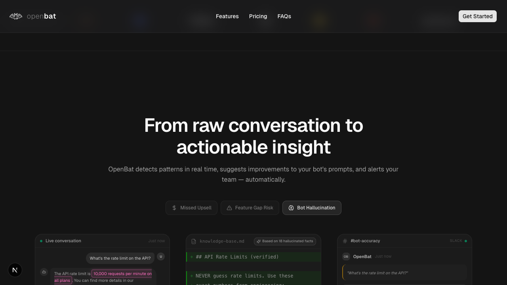

# Explore feature demos

## Overview

| Property | Value |
|----------|-------|
| **Flow** | Explore feature demos |
| **Starting Page** | `/` |
| **Persona** | Prospective customer evaluating the product before signing up |

## Description

Toggle between demo scenarios on the landing page to understand product value

## Preconditions

- User is on the landing page

## Steps

### Step 1

Scroll to the 'From raw conversation to actionable insight' section

### Step 2

Click 'Missed Upsell', 'Feature Gap Risk', and 'Bot Hallucination' buttons

### Step 3

Verify demo content changes between scenarios showing conversation, prompt fix, and Slack alert

## Expected Outcome

User sees different AI analysis scenarios and understands the product value proposition

## Related Flows

- [Navigate to sign up from landing page](navigate-to-sign-up-from-landing-page.md)
