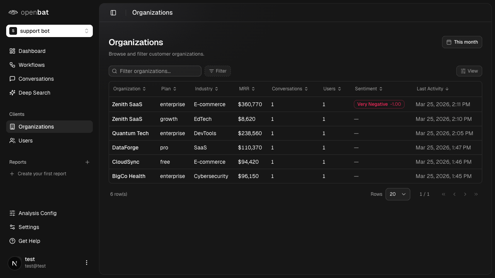
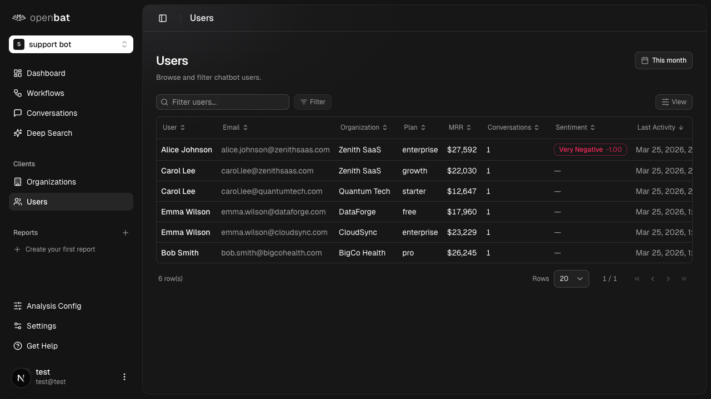
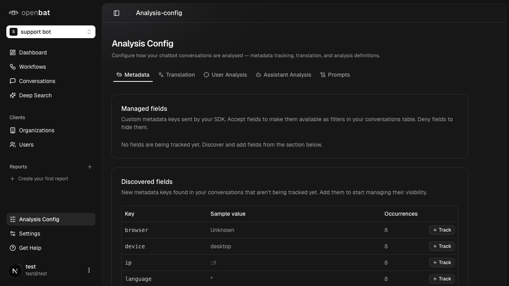
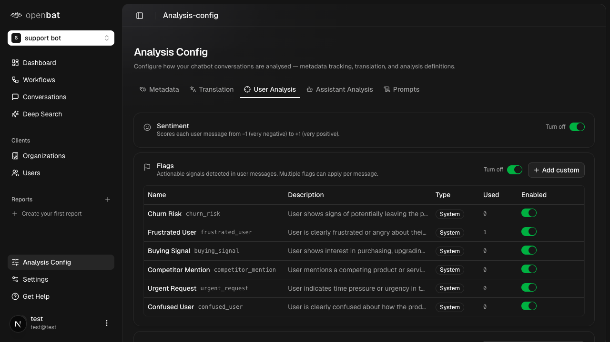
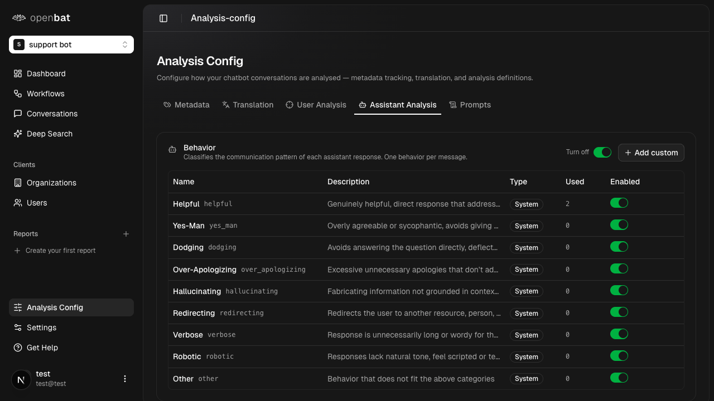

# Application Sitemap: http://localhost:3000

Generated: 2026-03-27T08:27:05.538Z
Pages discovered: 16
Flows identified: 31

---

## Pages

### 1. Landing Page (`/`)

Marketing homepage for OpenBat — an AI chatbot analytics platform described as 'Google Analytics for AI chatbots'. Features a hero section, animated chat widget demo showing conversation analysis, AI provider logos carousel, feature sections (conversation analysis, sentiment scoring, topic detection, workflow automation), code integration examples (Vercel AI SDK, TypeScript, Python, REST API), pricing tiers (Free through Enterprise), FAQs accordion, testimonials, and a CTA footer.

**Interactive elements:**
- link: Features (anchor)
- link: Pricing (anchor)
- link: FAQs (anchor)
- link: Login
- link: Sign Up
- link: Start Free
- link: Book a Demo
- button: Missed Upsell (feature demo toggle)
- button: Feature Gap Risk (feature demo toggle)
- button: Bot Hallucination (feature demo toggle)
- tablist: Code examples (Vercel AI SDK, TypeScript, Python, REST API)
- button: Copy code to clipboard
- link: Get Started (x5 pricing tiers)
- link: Contact Us (Enterprise)
- button: FAQ accordions (x5)
- link: customer support team
- link: Docs
- link: GitHub
- link: Blog

**Flows starting here:**
- [Navigate to sign up from landing page](flows/navigate-to-sign-up-from-landing-page.md) — Start the account creation process from the marketing homepage. Users can either click 'Sign Up' in the nav bar or 'Start Free' / 'Get Started' buttons throughout the page.
- [Explore feature demos](flows/explore-feature-demos.md) — Interactive feature demonstration on the landing page showing how OpenBat detects different conversation analysis patterns like missed upsells, feature gap risks, and bot hallucinations.

---

### 2. Login (`/auth/login`)

Authentication page for existing users to log into their OpenBat account. Supports email/password login and social authentication via Apple, Google, and Meta. Features a split layout with login form on the left and decorative image on the right.

**Interactive elements:**
- textbox: Email
- textbox: Password
- button: Login
- link: Forgot your password?
- button: Login with Apple
- button: Login with Google
- button: Login with Meta
- link: Terms of Service
- link: Privacy Policy

**Flows starting here:**
- [Email login](flows/email-login.md) — Authenticate using email and password credentials to access the main dashboard. This is the primary authentication method for existing users.
- [Social auth login](flows/social-auth-login.md) — Log in using a third-party social authentication provider (Apple, Google, or Meta) instead of email/password.
- [Forgot password flow](flows/forgot-password-flow.md) — Initiate a password reset by navigating to the forgot password page from the login form.

---

### 3. Sign Up (`/auth/sign-up`)

Account creation page for new users. Requires email, password, and password confirmation. Also supports social auth sign-up via Apple, Google, and Meta. Has a link back to the login page for existing users.

**Interactive elements:**
- textbox: Email
- textbox: Password
- textbox: Confirm Password
- button: Create Account
- button: Login with Apple
- button: Login with Google
- button: Login with Meta
- link: Sign in
- link: Terms of Service
- link: Privacy Policy

**Flows starting here:**
- [Email sign up](flows/email-sign-up.md) — Create a new OpenBat account using email and password. Password must be at least 8 characters long and must match the confirmation field.

---

### 4. Reset Your Password (`/auth/forgot-password`)

Password reset page where users enter their email to receive a password reset link. Simple form with a single email field and a link back to the login page.

**Interactive elements:**
- textbox: Email
- button: Send reset email
- link: Login

**Flows starting here:**
- [Password reset](flows/password-reset.md) — Request a password reset email to regain access to an account when the user has forgotten their password.

---

### 5. Dashboard — Chatbots (`/platform`)

Main authenticated dashboard showing all chatbots in the current organization. Chatbots are displayed as cards (or list view) with name, API key prefix, creator, last activity date, conversation count, and message count. Status tabs filter by Active, Pending, and Archive. Sidebar provides navigation to org-level Members and Settings pages.

**Interactive elements:**
- button: New chatbot
- button: Active/Pending/Archive tabs
- button: Card view
- button: List view
- button: chatbot card context menu (Open chatbot, Archive, Delete)
- link: Chatbots
- link: Members
- link: Settings
- button: org switcher (T Test)
- button: user profile menu

**Flows starting here:**
- [Open a chatbot](flows/open-a-chatbot.md) — Navigate into a specific chatbot's analytics dashboard to view conversations, sentiment data, and configure analysis settings.
- [Create a new chatbot](flows/create-a-new-chatbot.md) — Add a new chatbot to the organization to begin tracking and analyzing its conversations.
- [Switch organization](flows/switch-organization.md) — Switch between different organizations the user belongs to, or create a new organization.

---

### 6. Members (`/platform/members`)

Organization-level member management page. Shows a table of all members with their email, role (Owner, etc.), and join date. Allows inviting new members to the organization.

**Interactive elements:**
- button: Invite member
- table: members (Email, Role, Joined)

**Flows starting here:**
- [Invite a team member](flows/invite-a-team-member.md) — Add a new member to the organization to give them access to all chatbots and analytics within the org.

---

### 7. Organization Settings (`/platform/settings`)

Organization-level settings page with the ability to rename the organization and a danger zone for permanently deleting the organization and all its data.

**Interactive elements:**
- textbox: Organization name
- button: Save
- button: Delete organization (danger zone)

**Flows starting here:**
- [Rename organization](flows/rename-organization.md) — Change the display name of the current organization.
- [Delete organization](flows/delete-organization.md) — Permanently delete the organization and all its data including chatbots, conversations, and analysis results. This action cannot be undone.

---

### 8. Chatbot Dashboard (`/platform/{chatbotId}`)

Main analytics dashboard for a specific chatbot. Shows KPI cards (Conversations count, Messages count, Average Sentiment, Analyzed Today), date range selector, segment filter (by Plan). Has two tabs: 'User Insights' (sentiment trends chart, top frustrations, most dissatisfied users with investigate links, support topics, revenue signals with churn risk/buying signals/capability gaps, top intents, sentiment by segment, activity heatmap, languages) and 'Assistant Performance' (behavior alerts, resolution outcomes donut chart, quality flags table, capability gaps).

**Interactive elements:**
- button: date range selector (This month)
- combobox: Segment by (Plan)
- tab: User Insights
- tab: Assistant Performance
- link: Investigate (dissatisfied user)
- chart: User sentiment trend
- chart: Activity heatmap
- chart: Resolution outcomes donut

**Flows starting here:**
- [Investigate a dissatisfied user](flows/investigate-a-dissatisfied-user.md) — Drill into a specific user's conversations who has been flagged as highly dissatisfied to understand what went wrong.
- [Change analysis time period](flows/change-analysis-time-period.md) — Adjust the date range filter to view analytics for a different time period (e.g., this week, last 30 days, custom range).

---

### 9. Workflows (`/platform/{chatbotId}/workflows`)

Workflow automation page with three tabs: 'Workflows' (list of created workflows, empty state with create button), 'Runs' (execution history with status filters: All, Pending, Triggered, Skipped, Success, Failed), and 'Templates' (6 pre-built workflow templates categorized as Alerting, Escalation, Reporting, Moderation, General).

**Interactive elements:**
- button: Create workflow
- tab: Workflows
- tab: Runs
- tab: Templates
- button: status filters (All, Pending, Triggered, Skipped, Success, Failed)
- button: template source filters (All, Public, Your Org)
- button: template category filters (All, Alerting, Escalation, Reporting, Moderation, General)
- card: Negative Sentiment Alert template
- card: Escalation on Frustration template
- card: Topic Spike Monitor template
- card: Chatbot Quality Gate template
- card: Hallucination Flag template
- card: Positive Feedback Tracker template

**Flows starting here:**
- [Create a workflow from template](flows/create-a-workflow-from-template.md) — Create a new automated workflow using one of the pre-built templates to set up alerts and actions based on conversation analysis conditions (e.g., negative sentiment alerts, hallucination detection).
- [Create a workflow from scratch](flows/create-a-workflow-from-scratch.md) — Build a custom workflow with custom trigger conditions and actions for conversation analysis automation.

---

### 10. Conversations (`/platform/{chatbotId}/conversations`)

Browsable and filterable table of all conversations for a chatbot. Columns include User, Email, Organization, Messages count, Sentiment (with color-coded badges), Plan, Last Message timestamp, and Created date. Supports search, filtering, column sorting, date range selection, column visibility (View button), and pagination.

**Interactive elements:**
- textbox: Filter conversations (search)
- button: Filter
- button: View (column visibility)
- button: date range (This month)
- table: conversations
- pagination: rows per page, page navigation

**Flows starting here:**
- [View conversation detail](flows/view-conversation-detail.md) — Click on a conversation row to open the full conversation thread with message-level analysis, sentiment scoring, and user/organization metadata.
- [Filter conversations](flows/filter-conversations.md) — Use search and filter controls to narrow down the conversations list by keywords, sentiment, user attributes, or other criteria.

---

### 11. Conversation Detail (`/platform/{chatbotId}/conversations/{conversationId}`)

Full conversation thread view with breadcrumb navigation back to conversations list. Shows user name, organization, message count, and start date. Each message (user and assistant) displays the text with clickable highlighted analysis annotations — sentiment tags (e.g., 'Very Negative'), behavior flags (e.g., 'Frustrated User'), quality flags (e.g., 'premature closure'), and resolution status (e.g., 'Fully Resolved'). Right sidebar shows: Overall Sentiment (score and distribution), Conversation metadata (message count, conv ID, timestamps), User info (name, email, user ID, plan, industry, MRR), Organization info (name, org ID, plan, industry, MRR), and Session info (session ID, page URL, referrer, device, country).

**Interactive elements:**
- breadcrumb: Conversations > User Name
- button: Filter
- button: View
- button: message text (clickable for detail)
- button: sentiment tags
- button: behavior flags
- button: quality flags
- sidebar: Overall Sentiment panel
- sidebar: Conversation metadata
- sidebar: User info
- sidebar: Organization info
- sidebar: Session info

**Flows starting here:**
- [Review message-level analysis](flows/review-message-level-analysis.md) — Click on individual analysis tags on messages to understand the AI's reasoning for sentiment scores, behavior classifications, and quality flags.

---

### 12. Deep Search (`/platform/{chatbotId}/deep-search`)

Semantic search interface that finds conversations by meaning rather than exact keyword matching. Features a search input with a prominent 'Deep Search' button and a date range selector. Allows users to search for patterns like 'users asking about pricing' or 'billing issues' and get semantically relevant conversation results.

**Interactive elements:**
- textbox: Search by meaning
- button: Deep Search
- button: date range (This month)

**Flows starting here:**
- [Semantic search conversations](flows/semantic-search-conversations.md) — Search across all conversations using natural language queries that match by semantic meaning rather than exact keywords. Useful for finding patterns or themes that exact-match search would miss.

---

### 13. Organizations (Clients) (`/platform/{chatbotId}/organizations`)

Table listing all customer organizations that have interacted with the chatbot. Shows organization name, plan tier, industry, MRR (Monthly Recurring Revenue), conversation count, user count, average sentiment, and last activity timestamp. Supports search, filtering, column sorting, date range selection, and column visibility toggling.

**Interactive elements:**
- textbox: Filter organizations (search)
- button: Filter
- button: View (column visibility)
- button: date range (This month)
- table: organizations (Organization, Plan, Industry, MRR, Conversations, Users, Sentiment, Last Activity)
- pagination

**Flows starting here:**
- [Browse client organizations](flows/browse-client-organizations.md) — Review all customer organizations interacting with the chatbot, sorted by activity, MRR, or sentiment to identify high-value or at-risk accounts.

---

### 14. Users (Clients) (`/platform/{chatbotId}/users`)

Table listing all individual users who have interacted with the chatbot. Shows user name, email, organization, plan, MRR, conversation count, sentiment score, and last activity. Supports search, filtering, column sorting, and pagination.

**Interactive elements:**
- textbox: Filter users (search)
- button: Filter
- button: View (column visibility)
- button: date range (This month)
- table: users (User, Email, Organization, Plan, MRR, Conversations, Sentiment, Last Activity)
- pagination

**Flows starting here:**
- [Browse chatbot users](flows/browse-chatbot-users.md) — Review all individual users who have interacted with the chatbot, with their sentiment scores and activity data.

---

### 15. Analysis Config (`/platform/{chatbotId}/analysis-config`)

Configuration page for how chatbot conversations are analyzed. Has five tabs: 'Metadata' (manage/discover custom metadata fields from SDK with Track/Accept/Deny controls), 'Translation' (auto-translate toggle with primary language selector), 'User Analysis' (enable/disable sentiment scoring, configurable user flags like Churn Risk, Frustrated User, Buying Signal, Competitor Mention, Urgent Request, Confused User with custom flag creation), 'Assistant Analysis' (behavior classification toggles for Helpful, Yes-Man, Dodging, Over-Apologizing, Hallucinating, Redirecting, Verbose, Robotic, Other), and 'Prompts' (editable AI prompts for Sentiment, Intent, Topics, and Flags analysis with Default labels).

**Interactive elements:**
- tab: Metadata
- tab: Translation
- tab: User Analysis
- tab: Assistant Analysis
- tab: Prompts
- button: Track (metadata fields)
- switch: Auto-translate messages
- combobox: Primary language
- switch: Sentiment toggle
- switch: Flags toggle
- button: Add custom (flags)
- switch: individual flag toggles
- switch: Behavior toggle
- button: Add custom (behaviors)
- switch: individual behavior toggles
- card: Sentiment prompt (editable)
- card: Intent prompt (editable)
- card: Topics prompt (editable)
- card: Flags prompt (editable)

**Flows starting here:**
- [Configure user analysis flags](flows/configure-user-analysis-flags.md) — Enable, disable, or create custom flags for detecting actionable signals in user messages (e.g., churn risk, buying signals, competitor mentions).
- [Enable auto-translation](flows/enable-auto-translation.md) — Turn on automatic translation of non-primary-language messages so all analysis runs on translated text for consistency.
- [Edit analysis prompts](flows/edit-analysis-prompts.md) — Customize the AI prompts used for sentiment scoring, intent classification, topic identification, and flag detection to tailor analysis to the specific chatbot's domain.
- [Track metadata fields](flows/track-metadata-fields.md) — Accept discovered metadata keys from the SDK into the managed fields list to make them available as filters in the conversations table.

---

### 16. Chatbot Settings (`/platform/{chatbotId}/settings`)

Chatbot-level settings with six tabs: 'General' (chatbot name, chatbot ID with copy button, creation date), 'Company Info' (empty state requiring onboarding wizard), 'API Keys' (masked API key with copy and rotate buttons, security warning), 'Members' (chatbot-level member access table with Add member button), 'Webhooks' (webhook destination configuration for Discord, Slack, and custom endpoints with Add webhook button), and 'Import/Export Data' (export conversations as JSON with optional analysis results, import from JSON/CSV with template download).

**Interactive elements:**
- tab: General
- tab: Company Info
- tab: API Keys
- tab: Members
- tab: Webhooks
- tab: Import/Export Data
- textbox: Chatbot name
- button: Save
- button: Copy chatbot ID
- button: Rotate key
- button: Copy API key
- button: Add member
- button: Add webhook
- combobox: Export format (JSON)
- checkbox: Include analysis results
- button: Export
- button: Download template CSV
- button: Choose File (import)
- button: Import

**Flows starting here:**
- [Configure API keys](flows/configure-api-keys.md) — View, copy, or rotate the API key used to authenticate SDK requests to this chatbot.
- [Configure webhooks](flows/configure-webhooks.md) — Set up webhook URLs for Discord, Slack, or custom endpoints so workflows can deliver alerts to external systems.
- [Export conversation data](flows/export-conversation-data.md) — Download all conversations, messages, and optionally analysis results as a JSON file for offline analysis or backup.
- [Import conversation data](flows/import-conversation-data.md) — Upload historical conversations from a JSON or CSV file to analyze them in OpenBat. Useful for migrating from another tool or analyzing past data.

---

## All Discovered Flows

- [Navigate to sign up from landing page](flows/navigate-to-sign-up-from-landing-page.md)
- [Explore feature demos](flows/explore-feature-demos.md)
- [Email login](flows/email-login.md)
- [Social auth login](flows/social-auth-login.md)
- [Forgot password flow](flows/forgot-password-flow.md)
- [Email sign up](flows/email-sign-up.md)
- [Password reset](flows/password-reset.md)
- [Open a chatbot](flows/open-a-chatbot.md)
- [Create a new chatbot](flows/create-a-new-chatbot.md)
- [Switch organization](flows/switch-organization.md)
- [Invite a team member](flows/invite-a-team-member.md)
- [Rename organization](flows/rename-organization.md)
- [Delete organization](flows/delete-organization.md)
- [Investigate a dissatisfied user](flows/investigate-a-dissatisfied-user.md)
- [Change analysis time period](flows/change-analysis-time-period.md)
- [Create a workflow from template](flows/create-a-workflow-from-template.md)
- [Create a workflow from scratch](flows/create-a-workflow-from-scratch.md)
- [View conversation detail](flows/view-conversation-detail.md)
- [Filter conversations](flows/filter-conversations.md)
- [Review message-level analysis](flows/review-message-level-analysis.md)
- [Semantic search conversations](flows/semantic-search-conversations.md)
- [Browse client organizations](flows/browse-client-organizations.md)
- [Browse chatbot users](flows/browse-chatbot-users.md)
- [Configure user analysis flags](flows/configure-user-analysis-flags.md)
- [Enable auto-translation](flows/enable-auto-translation.md)
- [Edit analysis prompts](flows/edit-analysis-prompts.md)
- [Track metadata fields](flows/track-metadata-fields.md)
- [Configure API keys](flows/configure-api-keys.md)
- [Configure webhooks](flows/configure-webhooks.md)
- [Export conversation data](flows/export-conversation-data.md)
- [Import conversation data](flows/import-conversation-data.md)
