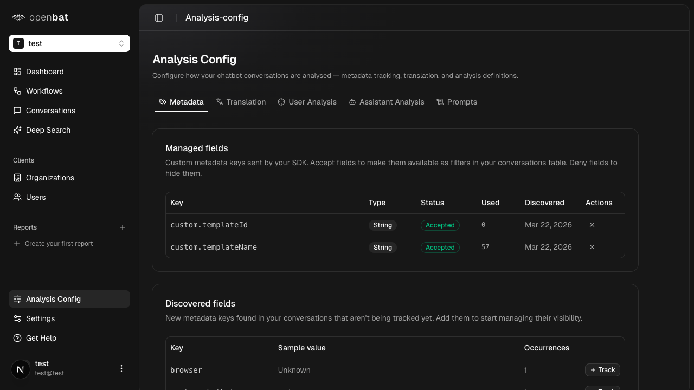

# Browse chatbot users

## Overview

| Property | Value |
|----------|-------|
| **Flow** | Browse chatbot users |
| **Starting Page** | Chatbot Users |
| **URL** | `/platform/[chatbotId]/users` |
| **Application** | http://localhost:3000 |
| **Discovered** | 2026-03-26T16:31:25.553Z |

## Description

View all individual users who have conversed with the chatbot, with their aggregate sentiment scores and conversation counts, to identify specific users who need attention.

## Who Uses This

Customer success manager or support lead wanting to identify individual users who are struggling or highly engaged.

## Preconditions

- User is logged in
- Chatbot has captured conversations with user metadata

## Page Context

Paginated table of individual users who have interacted with the chatbot. Columns: User, Email, Organization, Plan, MRR, Conversations, Sentiment (with colored badge and score), Last Activity. Supports text search, filtering, view configuration, column sorting, and date range selection. 26 rows with pagination.

### Starting Page



## Steps

### Step 1

Navigate to /platform/[chatbotId]/users

{{screenshot_1}}

### Step 2

Browse the users table

{{screenshot_2}}

### Step 3

Sort by Sentiment to find the most dissatisfied users

{{screenshot_3}}

### Step 4

Sort by Conversations to find the most active users

{{screenshot_4}}

### Step 5

Use the search box to find a specific user by name or email

{{screenshot_5}}

### Step 6

Click on a user row to see their details or conversations

{{screenshot_6}}

## Expected Outcome

User can identify which individual chatbot users need follow-up based on sentiment and engagement data.

## What Can Go Wrong

- No user data if conversations don't include user metadata

## Related Flows

- [Browse client organizations](browse-client-organizations.md)
- [Browse conversations](browse-conversations.md)

## Navigation Path

```
http://localhost:3000 → /platform/[chatbotId]/users → [Browse chatbot users]
```
