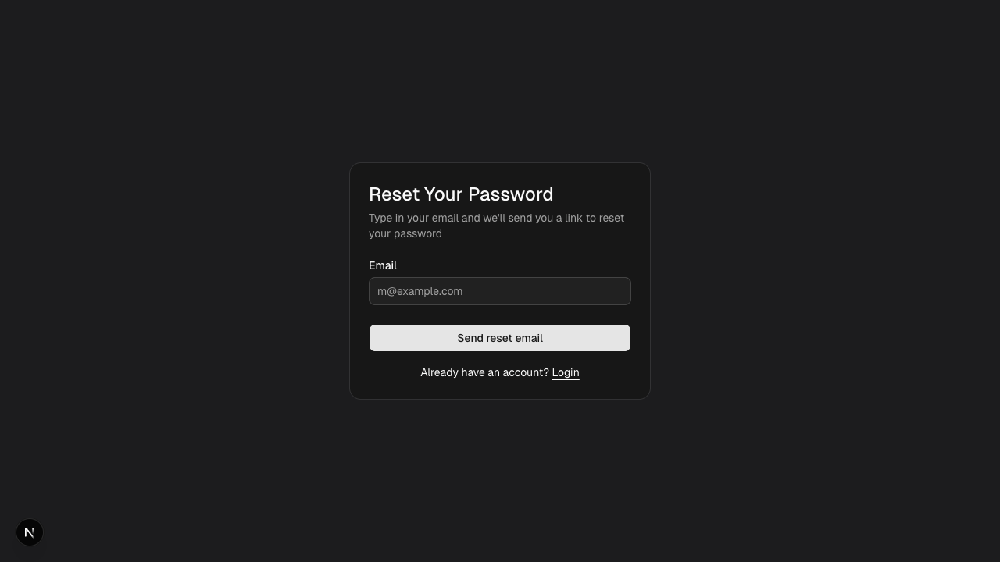

# Complete chatbot onboarding

## Overview

| Property | Value |
|----------|-------|
| **Flow** | Complete chatbot onboarding |
| **Starting Page** | Chatbot Onboarding |
| **URL** | `/platform/[chatbotId]/onboarding` |
| **Application** | http://localhost:3000 |
| **Discovered** | 2026-03-26T16:31:25.553Z |

## Description

Follow the SDK setup instructions to integrate OpenBat with an AI chatbot, then mark onboarding as complete to access the full dashboard.

## Who Uses This

Developer who just created a new chatbot and needs to integrate the SDK into their application.

## Preconditions

- User is logged in
- A new chatbot has just been created
- Chatbot has not been onboarded yet

## Page Context

SDK setup instructions page shown after creating a new chatbot. Guides the user through installing and configuring the OpenBat SDK. If the chatbot is already onboarded (settings.onboarded = true), this page redirects back to the chatbot dashboard.

### Starting Page



## Steps

### Step 1

After creating a chatbot, user is redirected to /platform/[chatbotId]/onboarding

{{screenshot_1}}

### Step 2

Copy the API key shown on the page

{{screenshot_2}}

### Step 3

Follow the SDK installation instructions (npm install, code snippet integration)

{{screenshot_3}}

### Step 4

Test the integration by sending a test message

{{screenshot_4}}

### Step 5

Mark onboarding as complete

{{screenshot_5}}

### Step 6

User is redirected to the chatbot dashboard

{{screenshot_6}}

## Expected Outcome

SDK is integrated with the user's chatbot application. Future conversations are captured and analyzed automatically. User sees the full dashboard.

## What Can Go Wrong

- API key copied incorrectly
- SDK not properly configured
- Network/firewall blocking capture endpoint

## Related Flows

- [Create new chatbot](create-new-chatbot.md)
- [View chatbot dashboard](view-chatbot-dashboard.md)

## Navigation Path

```
http://localhost:3000 → /platform/[chatbotId]/onboarding → [Complete chatbot onboarding]
```
