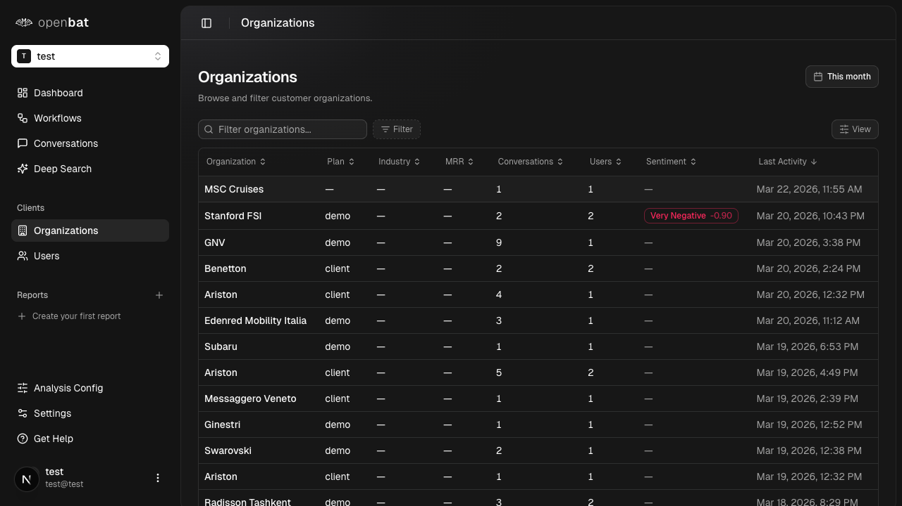

# Semantic search conversations

## Overview

| Property | Value |
|----------|-------|
| **Flow** | Semantic search conversations |
| **Starting Page** | Deep Search |
| **URL** | `/platform/[chatbotId]/deep-search` |
| **Application** | http://localhost:3000 |
| **Discovered** | 2026-03-26T16:31:25.553Z |

## Description

Search for conversations using natural language queries that match by semantic meaning, not just keywords. For example, searching 'users frustrated with billing' would find conversations about payment issues even if the word 'billing' wasn't used.

## Who Uses This

Product manager or CS lead investigating a specific theme across all conversations without knowing the exact keywords users used.

## Preconditions

- User is logged in
- Chatbot has captured and analyzed conversations

## Page Context

Semantic search page that finds conversations by meaning rather than keywords. Features a search input with a placeholder example ('users asking about pricing' or 'billing issues'), a date range picker, and a 'Deep Search' button. Shows an empty state when no query has been entered.

### Starting Page



## Steps

### Step 1

Navigate to /platform/[chatbotId]/deep-search

{{screenshot_1}}

### Step 2

Optionally set a date range using the date picker

{{screenshot_2}}

### Step 3

Type a natural language query in the search box (e.g., 'users asking about pricing' or 'complaints about response time')

{{screenshot_3}}

### Step 4

Click the 'Deep Search' button

{{screenshot_4}}

### Step 5

Review the semantically matched conversation results

{{screenshot_5}}

## Expected Outcome

A list of conversations matching the semantic intent of the query is displayed, ranked by relevance.

## What Can Go Wrong

- No matching conversations found
- Query too vague returns too many results

## Related Flows

- [Browse conversations](browse-conversations.md)
- [View conversation detail](view-conversation-detail.md)

## Navigation Path

```
http://localhost:3000 → /platform/[chatbotId]/deep-search → [Semantic search conversations]
```
