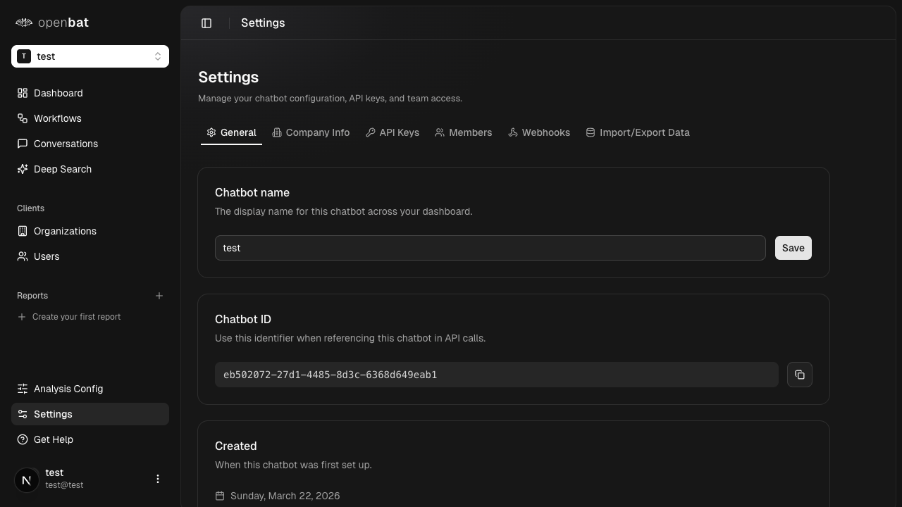

# Edit prompts

## Overview

| Property | Value |
|----------|-------|
| **Flow** | Edit prompts |
| **Starting Page** | Analysis Config |
| **URL** | `/platform/[chatbotId]/analysis-config` |
| **Application** | http://localhost:3000 |
| **Discovered** | 2026-03-26T09:34:43.182Z |

## Page Context

Configuration for conversation analysis with 5 tabs: Metadata, Translation, User Analysis, Assistant Analysis, Prompts

### Starting Page Screenshot



## Business Purpose

This flow allows users to **edit prompts** from the Analysis Config page.

## Related Flows (Same Page)

- [Manage metadata fields](manage-metadata-fields.md)
- [Configure translation](configure-translation.md)
- [Configure user analysis](configure-user-analysis.md)
- [Configure assistant analysis](configure-assistant-analysis.md)

## Available UI Elements

The following interactive elements are available on this page:

- tab: Metadata
- tab: Translation
- tab: User Analysis
- tab: Assistant Analysis
- tab: Prompts
- table: Managed fields (Key/Type/Status/Used/Discovered/Actions)
- table: Discovered fields (Key/Sample value/Occurrences)
- button: Track field

## Steps

### Step 1: Navigate to starting page

Navigate to `/platform/[chatbotId]/analysis-config` and verify the page loads correctly.

{{screenshot_1}}

### Step 2: Interact with tab: Prompts

Use the **tab: Prompts** element to progress through the flow.

{{screenshot_2}}

### Step 3: Verify outcome

Verify that the "Edit prompts" completed successfully and the expected state change occurred.

{{screenshot_3}}

## Navigation Path

```
http://localhost:3000 → /platform/[chatbotId]/analysis-config → [Edit prompts]
```
