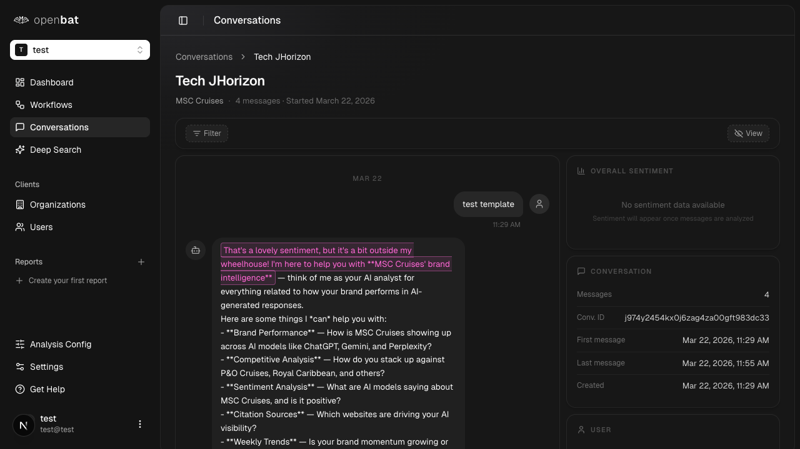

# Search conversations

## Overview

| Property | Value |
|----------|-------|
| **Flow** | Search conversations |
| **Starting Page** | Conversations List |
| **URL** | `/platform/[chatbotId]/conversations` |
| **Application** | http://localhost:3000 |
| **Discovered** | 2026-03-26T09:34:43.182Z |

## Page Context

Paginated conversation table with sortable columns, search, filters, and date range. Supports filtering by user or org via query params

### Starting Page Screenshot



## Business Purpose

This flow allows users to **search conversations** from the Conversations List page.

## Related Flows (Same Page)

- [Sort by column](sort-by-column.md)
- [Filter conversations](filter-conversations.md)
- [Navigate to conversation detail](navigate-to-conversation-detail.md)
- [Change page](change-page.md)

## Available UI Elements

The following interactive elements are available on this page:

- textbox: Filter conversations
- button: Filter
- button: View
- button: date range
- table: User/Email/Organization/Messages/Sentiment/Language/Plan/Last Message/Created
- pagination controls
- combobox: rows per page

## Steps

### Step 1: Navigate to starting page

Navigate to `/platform/[chatbotId]/conversations` and verify the page loads correctly.

{{screenshot_1}}

### Step 2: Interact with textbox: Filter conversations

Use the **textbox: Filter conversations** element to progress through the flow.

{{screenshot_2}}

### Step 3: Verify outcome

Verify that the "Search conversations" completed successfully and the expected state change occurred.

{{screenshot_3}}

## Navigation Path

```
http://localhost:3000 → /platform/[chatbotId]/conversations → [Search conversations]
```

## Related Pages

- **Deep Search** (`/platform/[chatbotId]/deep-search`) — Semantic search across conversations by meaning, not just keywords
