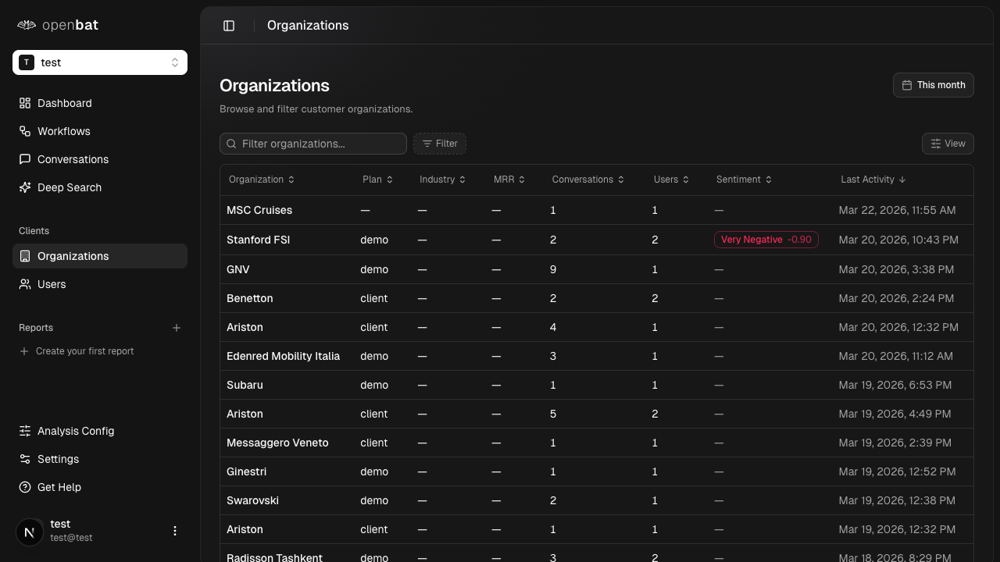

# Semantic search conversations

## Overview

| Property | Value |
|----------|-------|
| **Flow** | Semantic search conversations |
| **Starting Page** | Deep Search |
| **URL** | `/platform/[chatbotId]/deep-search` |
| **Application** | http://localhost:3000 |
| **Discovered** | 2026-03-26T09:34:43.182Z |

## Page Context

Semantic search across conversations by meaning, not just keywords

### Starting Page Screenshot



## Business Purpose

This flow allows users to **semantic search conversations** from the Deep Search page.

## Available UI Elements

The following interactive elements are available on this page:

- textbox: Search query
- button: Deep Search
- button: date range

## Steps

### Step 1: Navigate to starting page

Navigate to `/platform/[chatbotId]/deep-search` and verify the page loads correctly.

{{screenshot_1}}

### Step 2: Interact with textbox: Search query

Use the **textbox: Search query** element to progress through the flow.

{{screenshot_2}}

### Step 3: Interact with button: Deep Search

Use the **button: Deep Search** element to progress through the flow.

{{screenshot_3}}

### Step 4: Verify outcome

Verify that the "Semantic search conversations" completed successfully and the expected state change occurred.

{{screenshot_4}}

## Navigation Path

```
http://localhost:3000 → /platform/[chatbotId]/deep-search → [Semantic search conversations]
```
