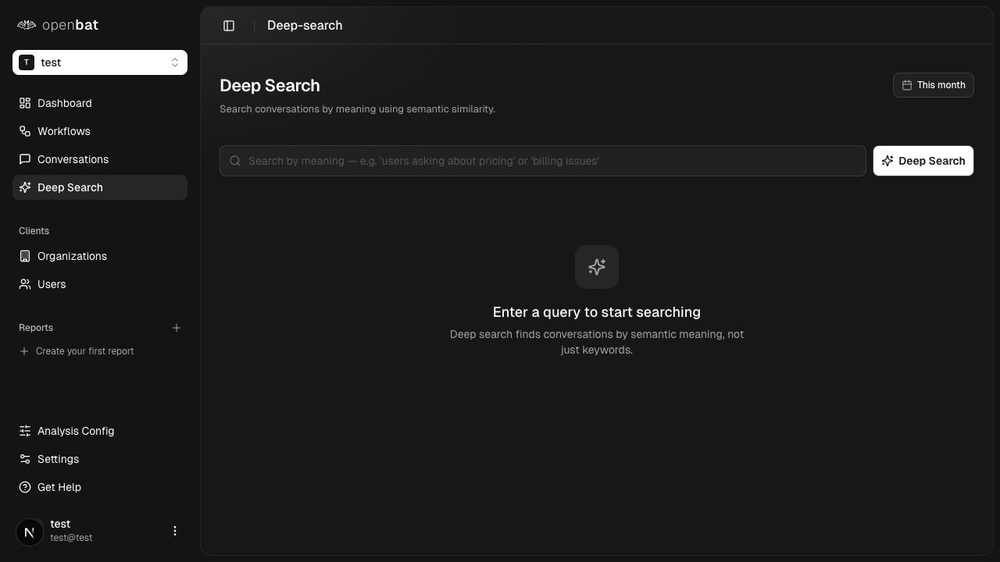
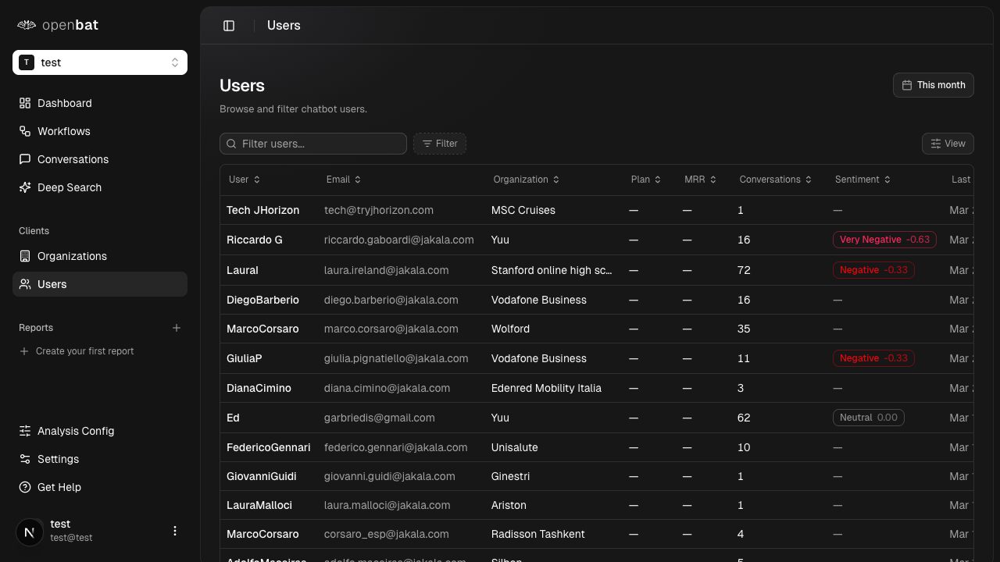
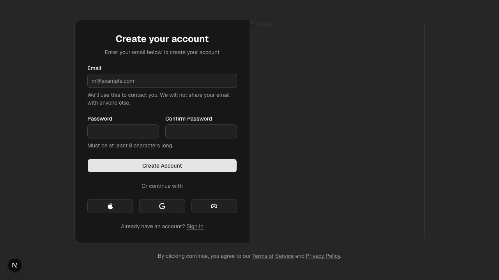

# Application Sitemap: http://localhost:3000

Generated: 2026-03-26T09:34:43.182Z
Pages discovered: 17
Flows identified: 50

---

## Pages

### 1. Landing Page (`/`)

Public marketing page with hero, features, pricing (6 tiers), FAQs, testimonials, code examples, and CTAs

**Interactive elements:**
- link: Features (anchor)
- link: Pricing (anchor)
- link: FAQs (anchor)
- link: Login
- link: Sign Up
- button: Start Free
- button: Book a Demo
- tabs: Vercel AI SDK / TypeScript / Python / REST API
- button: FAQ accordions (5)
- button: Missed Upsell / Feature Gap Risk / Bot Hallucination

**Flows starting here:**
- [Sign up flow](flows/sign-up-flow.md)
- [Login flow](flows/login-flow.md)
- [View pricing plans](flows/view-pricing-plans.md)
- [View code examples](flows/view-code-examples.md)
- [Expand FAQ answers](flows/expand-faq-answers.md)

---

### 2. Login Page (`/auth/login`)

Email/password login with social auth (Apple, Google, Meta) and forgot password link

**Interactive elements:**
- textbox: Email
- textbox: Password
- button: Login
- button: Login with Apple
- button: Login with Google
- button: Login with Meta
- link: Forgot your password?
- link: Terms of Service
- link: Privacy Policy

**Flows starting here:**
- [Email/password login](flows/email-password-login.md)
- [Social auth login](flows/social-auth-login.md)
- [Forgot password flow](flows/forgot-password-flow.md)

---

### 3. Sign Up Page (`/auth/sign-up`)

Account creation form with email, password, confirm password, social auth options

**Interactive elements:**
- textbox: Email
- textbox: Password
- textbox: Confirm Password
- button: Create Account
- button: Login with Apple
- button: Login with Google
- button: Login with Meta
- link: Sign in

**Flows starting here:**
- [Email sign up](flows/email-sign-up.md)
- [Social auth sign up](flows/social-auth-sign-up.md)

---

### 4. Forgot Password Page (`/auth/forgot-password`)

Password reset form with email input

**Interactive elements:**
- textbox: Email
- button: Send reset email
- link: Login

**Flows starting here:**
- [Password reset flow](flows/password-reset-flow.md)

---

### 5. Dashboard - Chatbots List (`/platform`)

Main authenticated dashboard showing all chatbots with card/list view toggle, status tabs (Active/Pending/Archive), and new chatbot button

**Interactive elements:**
- button: New chatbot
- button: Active/Pending/Archive tabs
- button: Card view
- button: List view
- button: chatbot context menu (Open/Archive/Delete)
- link: Chatbots
- link: Members
- link: Settings
- button: user profile dropdown (Settings, Log out)

**Flows starting here:**
- [Create new chatbot](flows/create-new-chatbot.md)
- [Open chatbot](flows/open-chatbot.md)
- [Archive chatbot](flows/archive-chatbot.md)
- [Delete chatbot](flows/delete-chatbot.md)
- [Switch card/list view](flows/switch-card-list-view.md)
- [Filter by status](flows/filter-by-status.md)
- [Log out](flows/log-out.md)

---

### 6. Organization Members (`/platform/members`)

Team member management with email, role, and join date

**Interactive elements:**
- table: Email/Role/Joined
- button: Invite member

**Flows starting here:**
- [Invite member flow](flows/invite-member-flow.md)

---

### 7. Organization Settings (`/platform/settings`)

Organization name editing and danger zone with delete option

**Interactive elements:**
- textbox: Organization name
- button: Save
- button: Delete organization

**Flows starting here:**
- [Rename organization](flows/rename-organization.md)
- [Delete organization](flows/delete-organization.md)

---

### 8. Chatbot Dashboard (`/platform/[chatbotId]`)

Overview dashboard with stats (conversations, messages, avg sentiment, analyzed today), date range selector, segment filter, and two tabs: User Insights and Assistant Performance

**Interactive elements:**
- button: date range selector
- combobox: Segment by Plan
- tab: User Insights
- tab: Assistant Performance
- chart: User sentiment trend
- table: Top user frustrations
- table: Most dissatisfied users
- table: Support topics
- section: Revenue signals
- chart: Top intents
- section: Sentiment by segment
- chart: Activity heatmap
- section: Languages
- section: Behavior alerts (Assistant Performance)
- chart: Resolution outcomes (Assistant Performance)

**Flows starting here:**
- [View user insights](flows/view-user-insights.md)
- [View assistant performance](flows/view-assistant-performance.md)
- [Change date range](flows/change-date-range.md)
- [Segment by plan](flows/segment-by-plan.md)
- [Investigate dissatisfied user](flows/investigate-dissatisfied-user.md)

---

### 9. Workflows (`/platform/[chatbotId]/workflows`)

Workflow automation page with Workflows/Runs/Templates tabs

**Interactive elements:**
- button: Create workflow
- tab: Workflows
- tab: Runs
- tab: Templates

**Flows starting here:**
- [Create workflow](flows/create-workflow.md)

---

### 10. Conversations List (`/platform/[chatbotId]/conversations`)

Paginated conversation table with sortable columns, search, filters, and date range. Supports filtering by user or org via query params

**Interactive elements:**
- textbox: Filter conversations
- button: Filter
- button: View
- button: date range
- table: User/Email/Organization/Messages/Sentiment/Language/Plan/Last Message/Created
- pagination controls
- combobox: rows per page

**Flows starting here:**
- [Search conversations](flows/search-conversations.md)
- [Sort by column](flows/sort-by-column.md)
- [Filter conversations](flows/filter-conversations.md)
- [Navigate to conversation detail](flows/navigate-to-conversation-detail.md)
- [Change page](flows/change-page.md)

---

### 11. Conversation Detail (`/platform/[chatbotId]/conversations/[id]`)

Chat bubble view of a conversation with right sidebar showing overall sentiment, conversation metadata, and user info

**Interactive elements:**
- breadcrumb: Conversations > User
- button: Filter
- button: View
- section: Overall Sentiment
- section: Conversation metadata (messages, conv ID, timestamps)
- section: User info

**Flows starting here:**
- [View conversation messages](flows/view-conversation-messages.md)
- [Navigate back to conversations](flows/navigate-back-to-conversations.md)

---

### 12. Deep Search (`/platform/[chatbotId]/deep-search`)

Semantic search across conversations by meaning, not just keywords

**Interactive elements:**
- textbox: Search query
- button: Deep Search
- button: date range

**Flows starting here:**
- [Semantic search conversations](flows/semantic-search-conversations.md)

---

### 13. Client Organizations (`/platform/[chatbotId]/organizations`)

Table of customer organizations with plan, industry, MRR, conversations, users, sentiment, last activity. Clicking a row filters conversations by that org

**Interactive elements:**
- textbox: Filter organizations
- button: Filter
- button: View
- button: date range
- table: Organization/Plan/Industry/MRR/Conversations/Users/Sentiment/Last Activity
- pagination controls

**Flows starting here:**
- [Browse organizations](flows/browse-organizations.md)
- [Filter by organization](flows/filter-by-organization.md)
- [Sort by column](flows/sort-by-column.md)

---

### 14. Client Users (`/platform/[chatbotId]/users`)

Table of chatbot users with email, organization, plan, MRR, conversations, sentiment, last activity. Clicking a row filters conversations by that user

**Interactive elements:**
- textbox: Filter users
- button: Filter
- button: View
- button: date range
- table: User/Email/Organization/Plan/MRR/Conversations/Sentiment/Last Activity
- pagination controls

**Flows starting here:**
- [Browse users](flows/browse-users.md)
- [Filter by user](flows/filter-by-user.md)
- [Sort by column](flows/sort-by-column.md)

---

### 15. Analysis Config (`/platform/[chatbotId]/analysis-config`)

Configuration for conversation analysis with 5 tabs: Metadata, Translation, User Analysis, Assistant Analysis, Prompts

**Interactive elements:**
- tab: Metadata
- tab: Translation
- tab: User Analysis
- tab: Assistant Analysis
- tab: Prompts
- table: Managed fields (Key/Type/Status/Used/Discovered/Actions)
- table: Discovered fields (Key/Sample value/Occurrences)
- button: Track field

**Flows starting here:**
- [Manage metadata fields](flows/manage-metadata-fields.md)
- [Configure translation](flows/configure-translation.md)
- [Configure user analysis](flows/configure-user-analysis.md)
- [Configure assistant analysis](flows/configure-assistant-analysis.md)
- [Edit prompts](flows/edit-prompts.md)

---

### 16. Chatbot Settings (`/platform/[chatbotId]/settings`)

Chatbot configuration with 6 tabs: General, Company Info, API Keys, Members, Webhooks, Import/Export Data

**Interactive elements:**
- tab: General
- tab: Company Info
- tab: API Keys
- tab: Members
- tab: Webhooks
- tab: Import/Export Data
- textbox: Chatbot name
- button: Save
- button: Copy Chatbot ID

**Flows starting here:**
- [Rename chatbot](flows/rename-chatbot.md)
- [Manage API keys](flows/manage-api-keys.md)
- [Manage members](flows/manage-members.md)
- [Configure webhooks](flows/configure-webhooks.md)
- [Import/Export data](flows/import-export-data.md)

---

### 17. Chatbot Onboarding (`/platform/[chatbotId]/onboarding`)

SDK setup instructions for new chatbots. Redirects to dashboard if already onboarded

**Flows starting here:**
- [Complete onboarding flow](flows/complete-onboarding-flow.md)

---

## All Discovered Flows

- [Sign up flow](flows/sign-up-flow.md)
- [Login flow](flows/login-flow.md)
- [View pricing plans](flows/view-pricing-plans.md)
- [View code examples](flows/view-code-examples.md)
- [Expand FAQ answers](flows/expand-faq-answers.md)
- [Email/password login](flows/email-password-login.md)
- [Social auth login](flows/social-auth-login.md)
- [Forgot password flow](flows/forgot-password-flow.md)
- [Email sign up](flows/email-sign-up.md)
- [Social auth sign up](flows/social-auth-sign-up.md)
- [Password reset flow](flows/password-reset-flow.md)
- [Create new chatbot](flows/create-new-chatbot.md)
- [Open chatbot](flows/open-chatbot.md)
- [Archive chatbot](flows/archive-chatbot.md)
- [Delete chatbot](flows/delete-chatbot.md)
- [Switch card/list view](flows/switch-card-list-view.md)
- [Filter by status](flows/filter-by-status.md)
- [Log out](flows/log-out.md)
- [Invite member flow](flows/invite-member-flow.md)
- [Rename organization](flows/rename-organization.md)
- [Delete organization](flows/delete-organization.md)
- [View user insights](flows/view-user-insights.md)
- [View assistant performance](flows/view-assistant-performance.md)
- [Change date range](flows/change-date-range.md)
- [Segment by plan](flows/segment-by-plan.md)
- [Investigate dissatisfied user](flows/investigate-dissatisfied-user.md)
- [Create workflow](flows/create-workflow.md)
- [Search conversations](flows/search-conversations.md)
- [Sort by column](flows/sort-by-column.md)
- [Filter conversations](flows/filter-conversations.md)
- [Navigate to conversation detail](flows/navigate-to-conversation-detail.md)
- [Change page](flows/change-page.md)
- [View conversation messages](flows/view-conversation-messages.md)
- [Navigate back to conversations](flows/navigate-back-to-conversations.md)
- [Semantic search conversations](flows/semantic-search-conversations.md)
- [Browse organizations](flows/browse-organizations.md)
- [Filter by organization](flows/filter-by-organization.md)
- [Browse users](flows/browse-users.md)
- [Filter by user](flows/filter-by-user.md)
- [Manage metadata fields](flows/manage-metadata-fields.md)
- [Configure translation](flows/configure-translation.md)
- [Configure user analysis](flows/configure-user-analysis.md)
- [Configure assistant analysis](flows/configure-assistant-analysis.md)
- [Edit prompts](flows/edit-prompts.md)
- [Rename chatbot](flows/rename-chatbot.md)
- [Manage API keys](flows/manage-api-keys.md)
- [Manage members](flows/manage-members.md)
- [Configure webhooks](flows/configure-webhooks.md)
- [Import/Export data](flows/import-export-data.md)
- [Complete onboarding flow](flows/complete-onboarding-flow.md)
