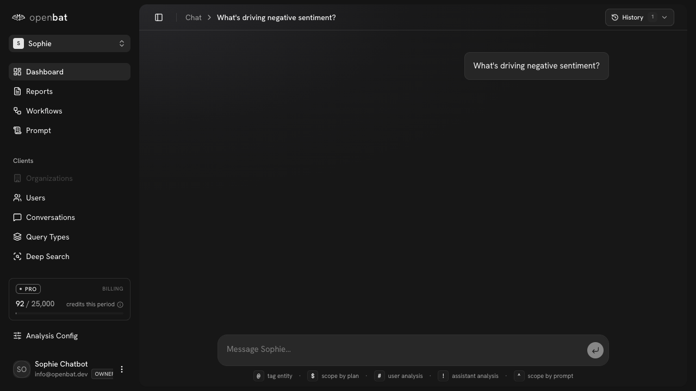

# Ask AI about chatbot data

## Overview

| Property | Value |
|----------|-------|
| **Flow** | Ask AI about chatbot data |
| **Starting Page** | `/platform/[chatbotId]` |
| **Persona** | Product manager who wants quick answers without writing queries |

## Description

Ask a natural-language question to the platform AI assistant about chatbot analytics

## Preconditions

- Chatbot has captured conversations
- User is on the chatbot dashboard

## Steps

### Step 1

On Sophie dashboard, view message input field with command hints (@ tag entity, $ scope by plan, # user analysis, ! assistant analysis, ^ scope by prompt)

### Step 2

Type 'What's driving negative sentiment?' and click Submit — URL updates with ?c= conversation ID, question shown in chat view

## Expected Outcome

AI responds with relevant data, charts, and insights based on the chatbot's conversation data

## Failure Modes

### Submit a question — AI backend returns errors (401/404/400/422)

Silent failure: question appears in chat but no AI response, no error message, no loading indicator timeout. User sees empty chat forever.

## Related Flows

- [Create report from template](create-report-from-template.md)
