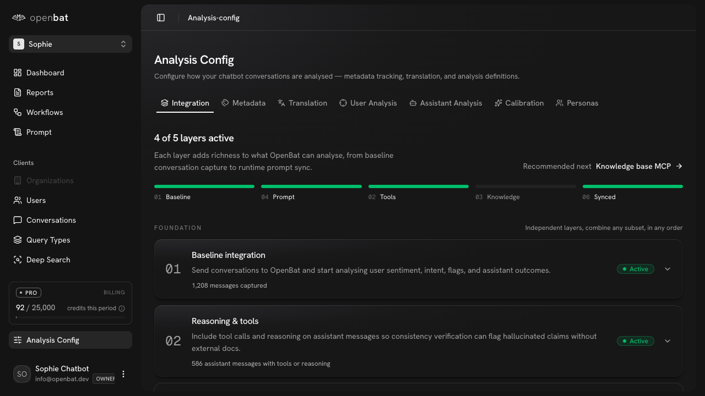
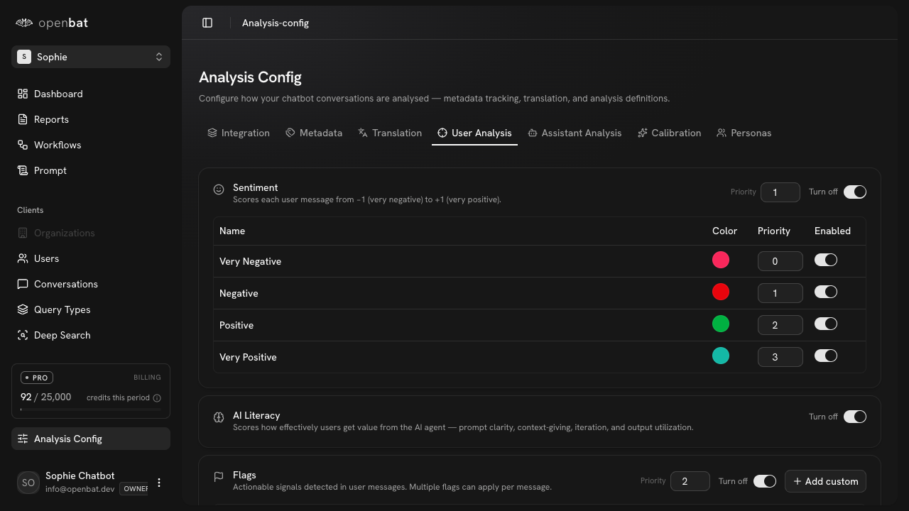

# Configure analysis definitions

## Overview

| Property | Value |
|----------|-------|
| **Flow** | Configure analysis definitions |
| **Starting Page** | `/platform/[chatbotId]/analysis-config` |
| **Persona** | Product lead who wants to add a custom flag for 'pricing_complaint' specific to their product |

## Description

Add or modify analysis definitions for conversation analysis

## Preconditions

- User has admin or owner role

## Steps

### Step 1

Navigate to /platform/[chatbotId]/analysis-config — tabs: Integration, Metadata, Translation, User Analysis, Assistant Analysis, Calibration, Personas. Shows '4 of 5 layers active' with layer progression (Baseline, Prompt, Tools, Knowledge, Synced).

### Step 2

Click 'User Analysis' tab — shows Sentiment section (Very Negative/Negative/Positive/Very Positive with color, priority, enabled toggles), AI Literacy section, Flags section with '+ Add custom' button for defining new flag types

## Expected Outcome

New analysis definition is active and will be detected in future conversations

## Related Flows

- [Review a specific conversation](review-a-specific-conversation.md)

## Alternative Paths

- Assistant Analysis tab
- Calibration tab
