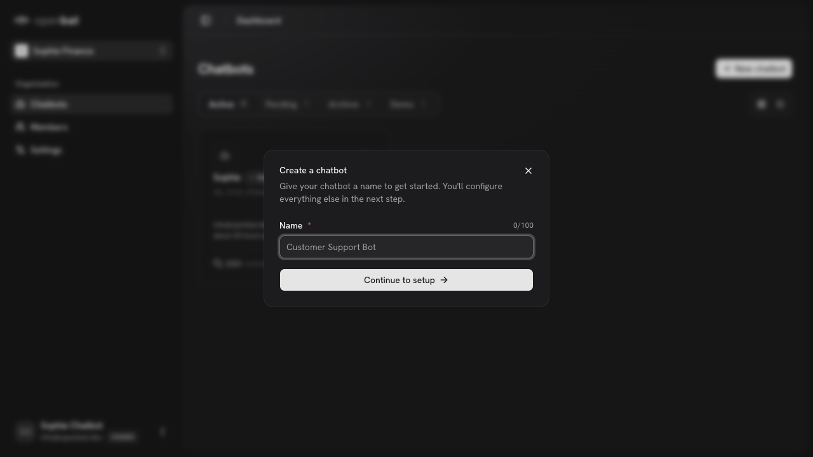
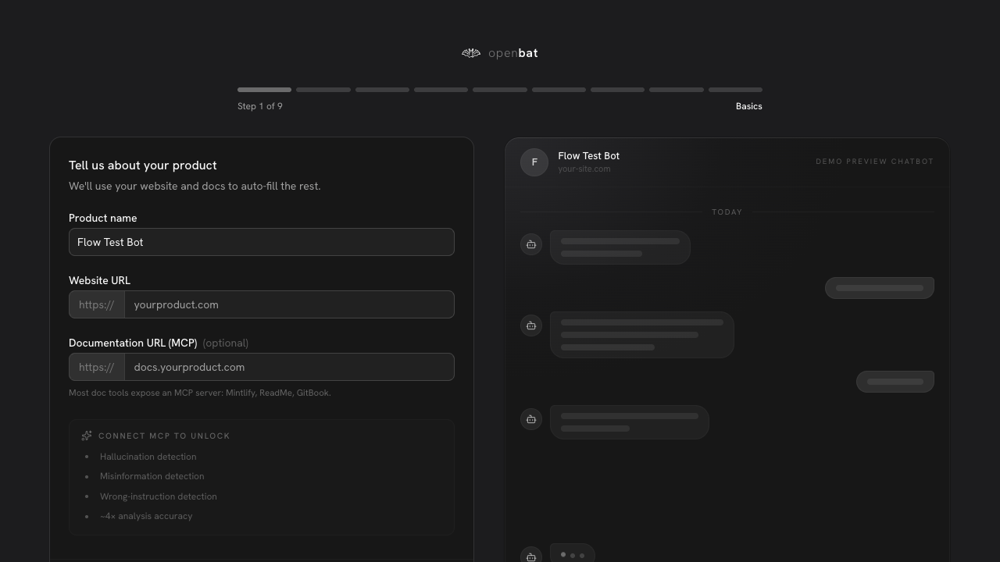

# Create new chatbot

## Overview

| Property | Value |
|----------|-------|
| **Flow** | Create new chatbot |
| **Starting Page** | `/platform` |
| **Persona** | Team admin or owner who wants to set up analytics for a new chatbot |

## Description

Create a new chatbot and start the onboarding wizard

## Preconditions

- User is authenticated
- User has owner or admin role in the organization

## Steps

### Step 1

Navigate to /platform — chatbot list visible with Active/Pending/Archive/Demo tabs

### Step 2

Click '+ New chatbot' — modal opens with Name field (0/100 char counter) and 'Continue to setup' button

### Step 3

Enter chatbot name ('Flow Test Bot') and click 'Continue to setup'

### Step 4

Redirected to 9-step onboarding wizard (Basics, Product, Brand, Pricing, Competitors, Analysis, Personas, Calibrate, Connect) — Step 1 shows Product name, Website URL, Documentation URL (MCP), and demo preview chatbot

### Step 5

Test chatbot created then deleted via Pending tab → three-dot menu → Delete with confirmation dialog

## Expected Outcome

New chatbot is created with an API key, and user is guided through SDK setup on the onboarding page

## Related Flows

- [Explore demo chatbot](explore-demo-chatbot.md)
