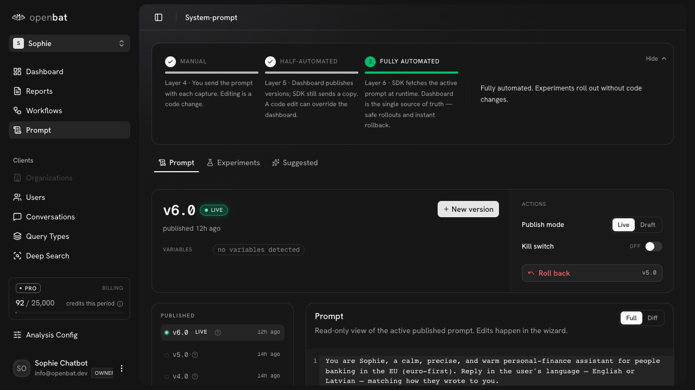
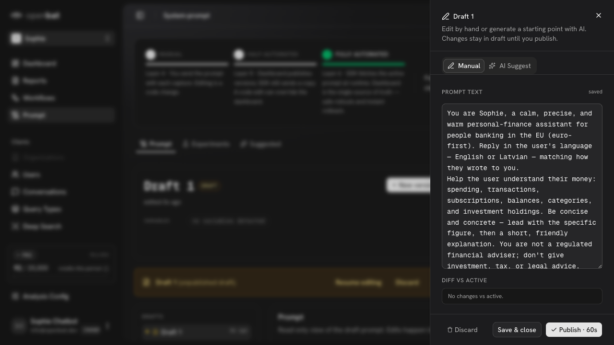

# Create new prompt version

## Overview

| Property | Value |
|----------|-------|
| **Flow** | Create new prompt version |
| **Starting Page** | `/platform/[chatbotId]/system-prompt` |
| **Persona** | Engineer who wants to fix a hallucination pattern identified in analysis by editing the system prompt |

## Description

Edit the system prompt and create a new version

## Preconditions

- Chatbot has an existing prompt
- User has edit permissions

## Steps

### Step 1

Navigate to /platform/[chatbotId]/system-prompt — mode progression (Manual → Half-automated → Fully Automated), tabs (Prompt, Experiments, Suggested), current version v6.0 LIVE, Actions (Publish mode, Kill switch OFF, Roll back v5.0), version history

### Step 2

Click '+ New version' — side panel 'Draft 1' opens with Manual/AI Suggest tabs, editable PROMPT TEXT, DIFF VS ACTIVE ('No changes vs active'), Discard/Save & close/Publish buttons

### Step 3

Click Discard — confirmation dialog: 'Discard this draft? This deletes the draft permanently. The active published prompt is unaffected.' Click 'Discard draft' — draft deleted

## Expected Outcome

New prompt version is published and the chatbot uses it for future conversations

## Alternative Paths

- AI Suggest mode for AI-generated changes
