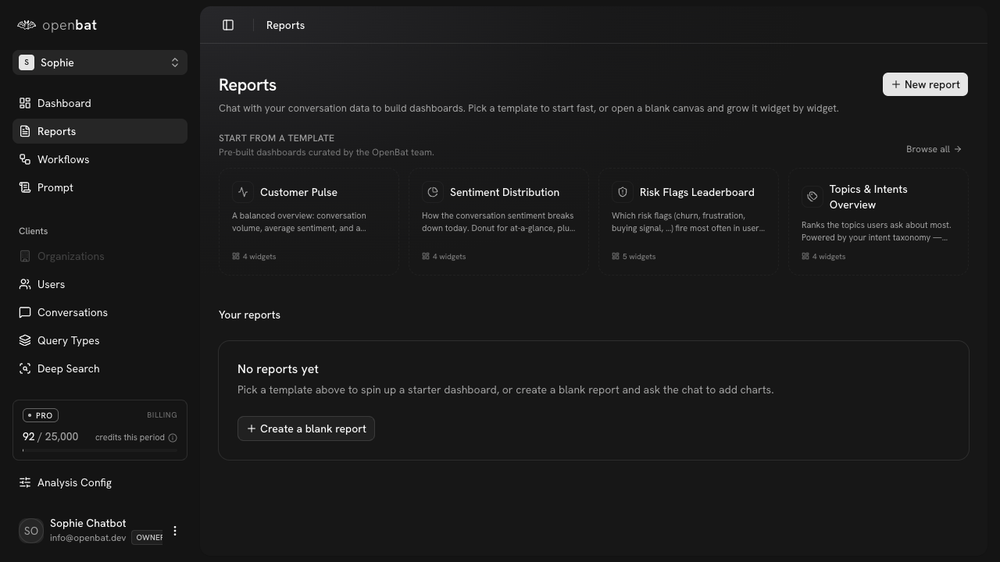
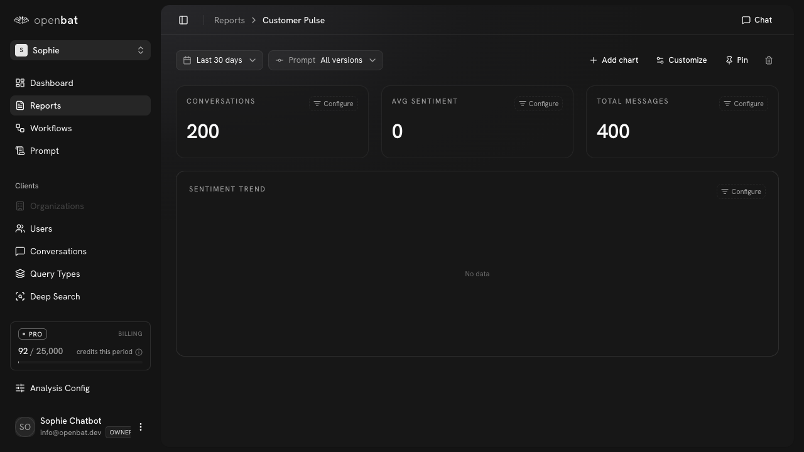

# Create report from template

## Overview

| Property | Value |
|----------|-------|
| **Flow** | Create report from template |
| **Starting Page** | `/platform/[chatbotId]/reports` |
| **Persona** | CS manager who wants a weekly sentiment overview without building from scratch |

## Description

Create a dashboard report using a pre-built template

## Preconditions

- Chatbot has conversation data

## Steps

### Step 1

Navigate to /platform/[chatbotId]/reports — 'START FROM A TEMPLATE' section with 4 templates (Customer Pulse, Sentiment Distribution, Risk Flags Leaderboard, Topics & Intents Overview), 'Your reports' section with 'No reports yet'

### Step 2

Click 'Customer Pulse' template card

### Step 3

Report created and loaded — shows CONVERSATIONS (200), AVG SENTIMENT (0), TOTAL MESSAGES (400), SENTIMENT TREND (No data). Filters: Last 30 days, Prompt: All versions. Actions: + Add chart, Customize, Pin, Delete. Chat button for copilot.

## Expected Outcome

A new report is created with pre-populated widgets showing relevant chatbot analytics

## Related Flows

- [Ask AI about chatbot data](ask-ai-about-chatbot-data.md)

## Alternative Paths

- Create a blank report
- New report button
