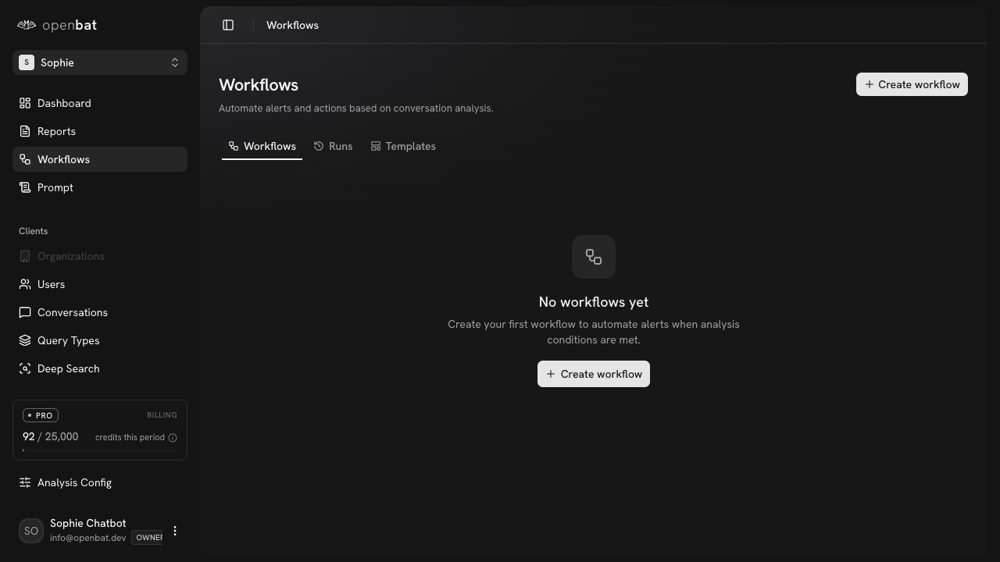
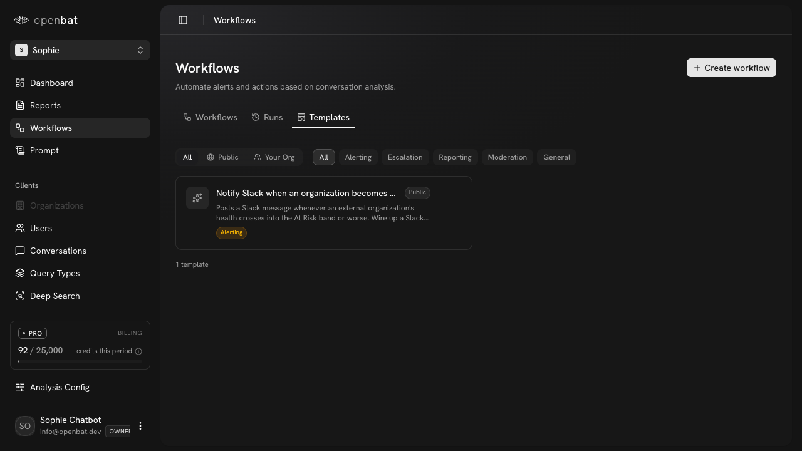
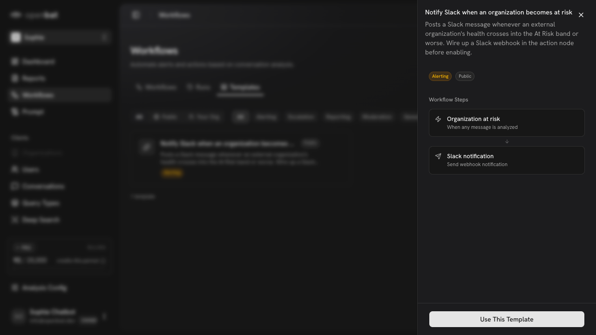

# Create workflow from template

## Overview

| Property | Value |
|----------|-------|
| **Flow** | Create workflow from template |
| **Starting Page** | `/platform/[chatbotId]/workflows` |
| **Persona** | CS manager who wants Slack notifications when churn risk is detected |

## Description

Create an automated workflow from a pre-built template

## Preconditions

- Chatbot has analysis running
- Webhook destination configured in settings

## Steps

### Step 1

Navigate to /platform/[chatbotId]/workflows — tabs: Workflows, Runs, Templates. 'No workflows yet' shown.

### Step 2

Click 'Templates' tab — filter pills (All, Public, Your Org | Alerting, Escalation, Reporting, Moderation, General). 1 template: 'Notify Slack when an organization becomes at risk' (Public, Alerting)

### Step 3

Click template — preview panel shows title, description, tags (Alerting, Public), Workflow Steps (Organization at risk → Slack notification), 'Use This Template' button

## Expected Outcome

Workflow is created and will trigger automatically when conditions are met during conversation analysis

## Alternative Paths

- Create workflow button (blank)
