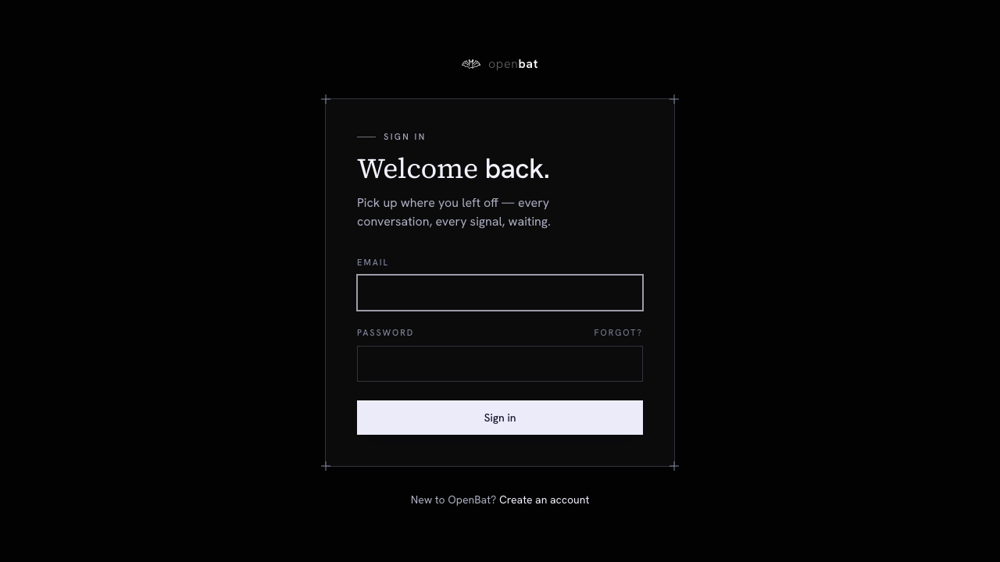
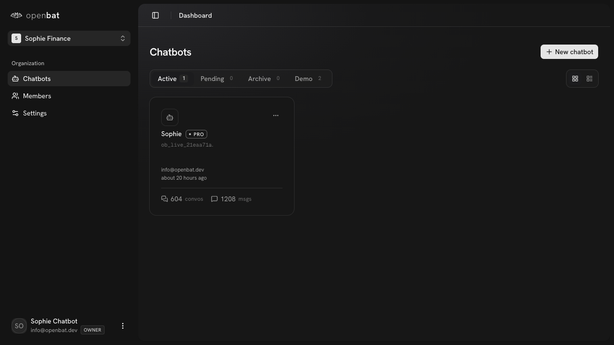
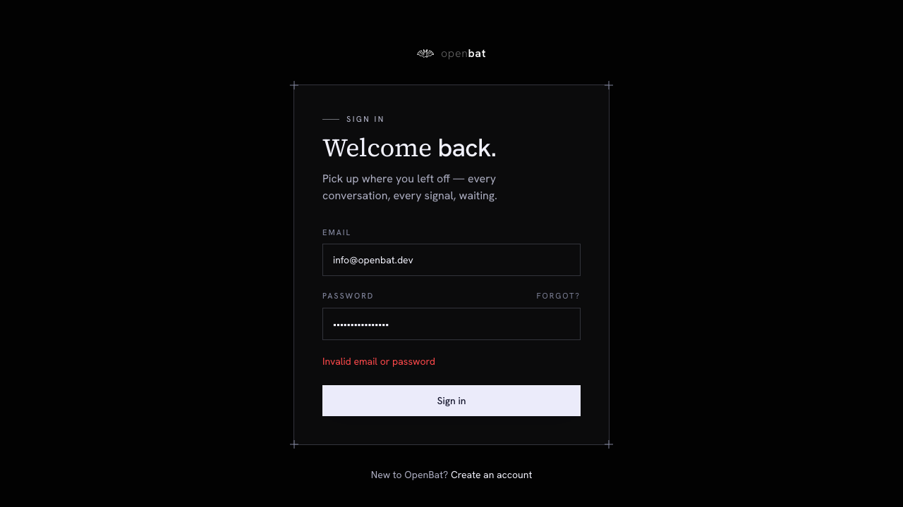

# Email login

## Overview

| Property | Value |
|----------|-------|
| **Flow** | Email login |
| **Starting Page** | `/auth/login` |
| **Persona** | Returning user who already has an account and wants to access their chatbot analytics dashboard |

## Description

Authenticate using email and password

## Preconditions

- User has an existing account
- User is not already logged in
- User knows their email and password

## Steps

### Step 1

Navigate to /auth/login — form visible with 'Welcome back.' heading, Email field, Password field, 'Sign in' button

### Step 2

Enter email address (info@openbat.dev)

### Step 3

Enter password

### Step 4

Click 'Sign in' button

### Step 5

Verify redirect to /platform — dashboard shows 'Sophie Finance' org with chatbot list

## Expected Outcome

User is redirected to /platform showing their organization's chatbot list

## Failure Modes

### Submit form with wrong password

Inline error shown in red: 'Invalid email or password'. Form stays on /auth/login.

## Related Flows

- [Password reset request](password-reset-request.md)
- [Email sign up](email-sign-up.md)

## Alternative Paths

- Navigate to /auth/sign-up via 'Create an account' link
