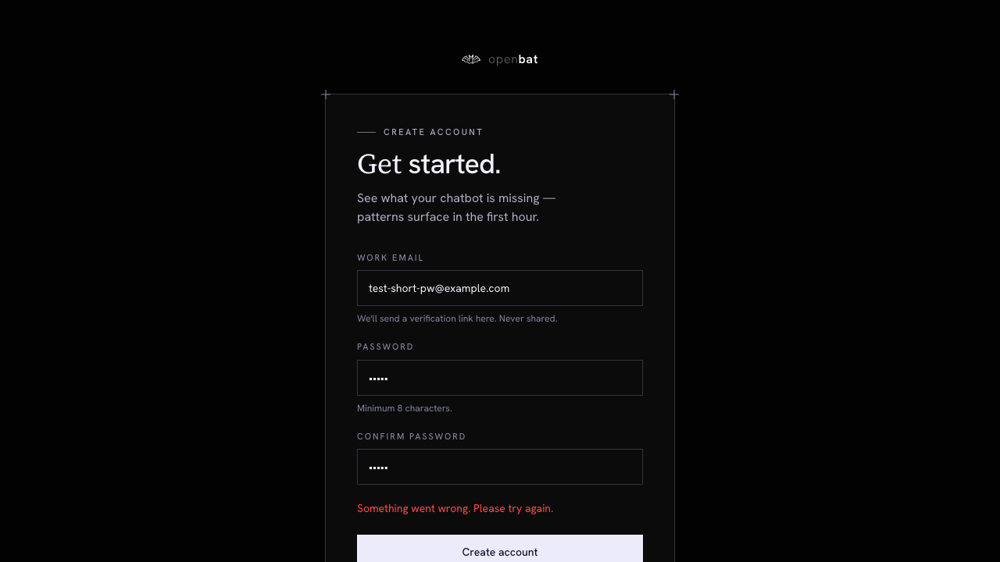
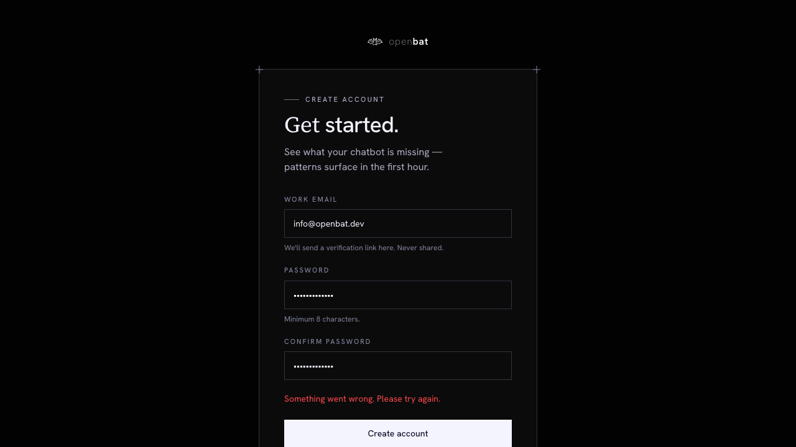

# Email sign up

## Overview

| Property | Value |
|----------|-------|
| **Flow** | Email sign up |
| **Starting Page** | `/auth/sign-up` |
| **Persona** | New user who wants to set up chatbot analytics for the first time |

## Description

Register a new account with work email and password

## Preconditions

- User does not already have an account
- User has access to their work email

## Steps

### Step 1

Navigate to /auth/sign-up — 'Get started.' heading with Work email, Password (min 8 chars), Confirm password fields, 'Create account' button, Terms/Privacy links

## Expected Outcome

Account is created and verified. User can now log in and is redirected to /platform where an organization is auto-created.

## Failure Modes

### Password too short (5 chars)

Generic error: 'Something went wrong. Please try again.' — not specific about password length. UX could be improved.

### Passwords don't match

Specific client-side validation: 'Passwords do not match.'

### Duplicate email (existing account)

Generic error: 'Something went wrong. Please try again.' — same generic message as password-too-short (good for security, doesn't reveal account existence, but confusing UX)

## Related Flows

- [Email login](email-login.md)
- [Sign up from landing page](sign-up-from-landing-page.md)

## Alternative Paths

- Navigate to /auth/login via 'Sign in' link
