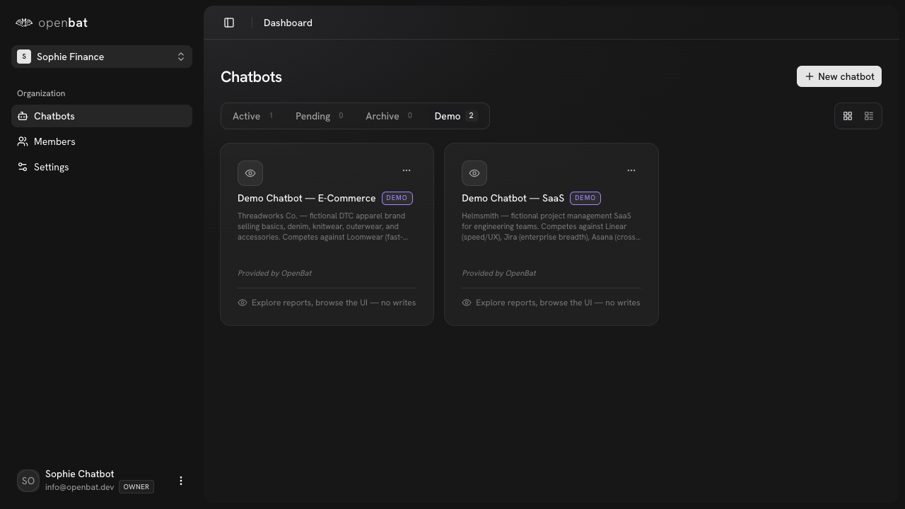

# Explore demo chatbot

## Overview

| Property | Value |
|----------|-------|
| **Flow** | Explore demo chatbot |
| **Starting Page** | `/platform` |
| **Persona** | New user evaluating OpenBat, or existing user wanting to see what a fully populated dashboard looks like |

## Description

Browse a read-only demo chatbot dashboard with sample data

## Preconditions

- User is authenticated

## Steps

### Step 1

Navigate to /platform — on Pending tab, switch to Demo tab

### Step 2

Click 'Demo' tab — 2 demo chatbots visible: 'Demo Chatbot — E-Commerce' (Threadworks Co.) and 'Demo Chatbot — SaaS' (Helmsmith), both marked 'Provided by OpenBat' and 'Explore reports, browse the UI — no writes'

### Step 3

Click E-Commerce demo — full dashboard loads with DEMO banner, AI chat, AT-RISK ORGS, ALERTS (13 buying signals), PERFORMANCE (Resolution 54%, Sentiment positive, 3 quality issues, AI Literacy 74/100), full sidebar navigation

## Expected Outcome

User sees a fully populated dashboard with sample conversations, analyses, and reports — all read-only

## Related Flows

- [Create new chatbot](create-new-chatbot.md)

## Alternative Paths

- SaaS demo chatbot
