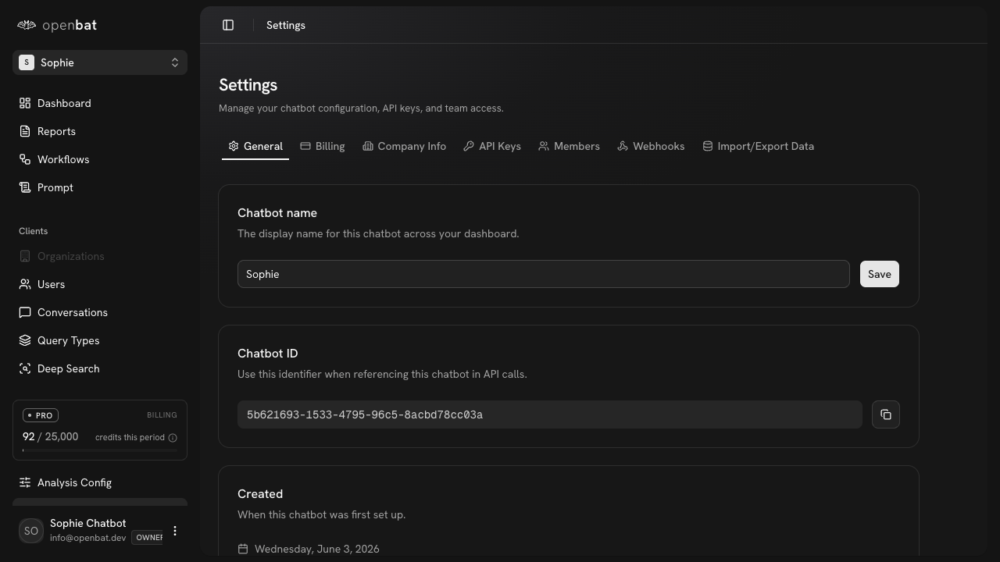
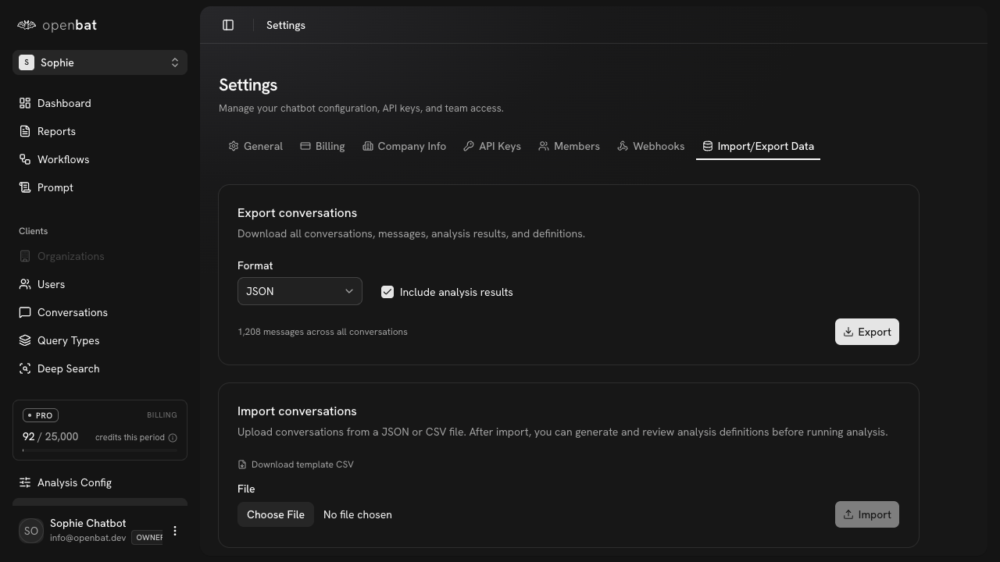

# Export conversation data

## Overview

| Property | Value |
|----------|-------|
| **Flow** | Export conversation data |
| **Starting Page** | `/platform/[chatbotId]/settings` |
| **Persona** | Data analyst who needs chatbot conversation data for custom analysis in their own tools |

## Description

Download chatbot conversation data for external analysis

## Preconditions

- Chatbot has conversations

## Steps

### Step 1

Navigate to /platform/[chatbotId]/settings — tabs: General, Billing, Company Info, API Keys, Members, Webhooks, Import/Export Data

### Step 2

Click 'Import/Export Data' tab — Export section: Format dropdown (JSON), 'Include analysis results' checkbox (checked), '1,208 messages across all conversations', Export button. Import section: Upload JSON/CSV, Download template CSV, Choose File + Import button.

## Expected Outcome

Complete conversation data file is downloaded with all messages and optionally analysis results

## Alternative Paths

- Import conversations from JSON/CSV
