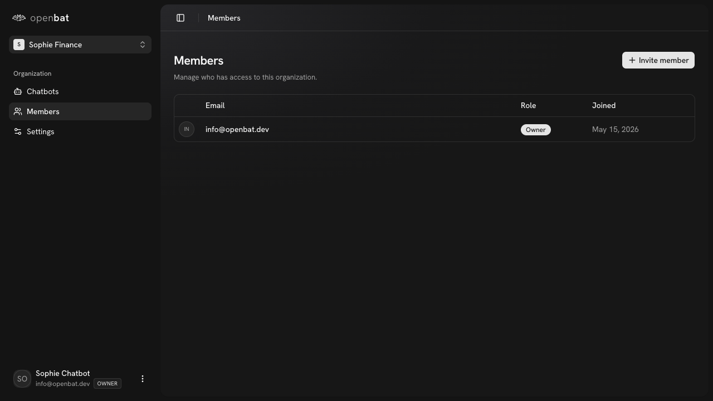
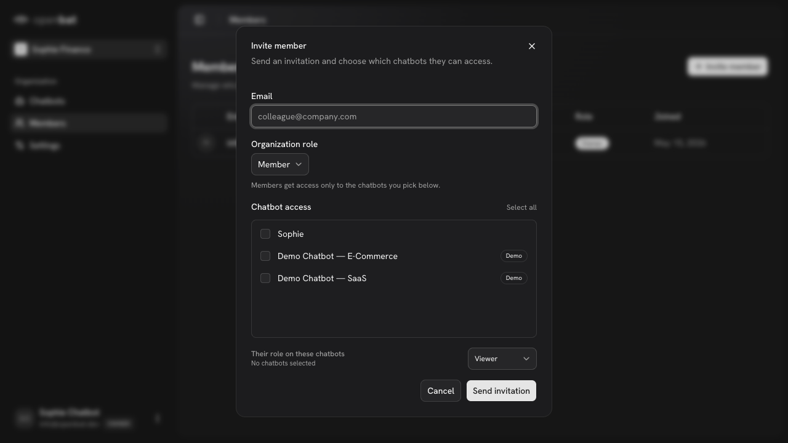

# Invite team member

## Overview

| Property | Value |
|----------|-------|
| **Flow** | Invite team member |
| **Starting Page** | `/platform/members` |
| **Persona** | Organization owner who wants to give a colleague access to chatbot analytics |

## Description

Send an invitation to a colleague to join the organization

## Preconditions

- User has owner or admin role
- Invitee has an email address

## Steps

### Step 1

Navigate to /platform/members — member table visible with current member (info@openbat.dev, Owner, May 15, 2026)

### Step 2

Click '+ Invite member' — modal opens with Email field, Organization role dropdown (Member), Chatbot access checkboxes (Sophie, E-Commerce Demo, SaaS Demo) with 'Select all', chatbot role dropdown (Viewer), Cancel/Send invitation buttons

## Expected Outcome

Invitation email is sent. Invitee clicks the link to accept and join the organization.
