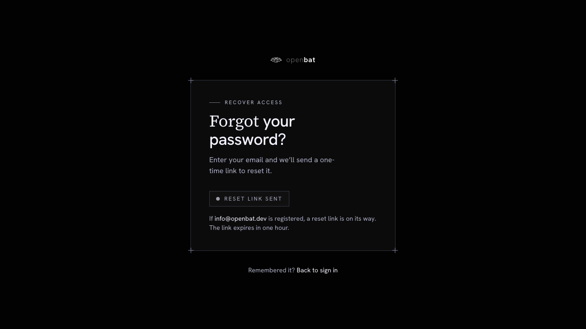
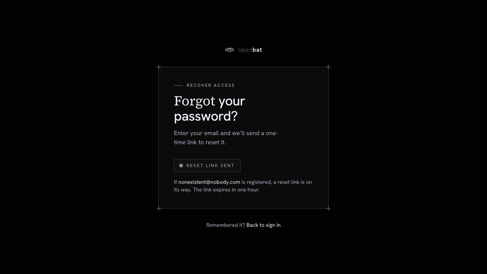

# Password reset request

## Overview

| Property | Value |
|----------|-------|
| **Flow** | Password reset request |
| **Starting Page** | `/auth/forgot-password` |
| **Persona** | Existing user who cannot remember their password |

## Description

Request a password reset email

## Preconditions

- User has an existing account with a verified email

## Steps

### Step 1

Navigate to /auth/forgot-password — 'Forgot your password?' heading with Email field, 'Send reset link' button, 'Back to sign in' link

### Step 2

Enter email (info@openbat.dev) and click 'Send reset link'

### Step 3

Success state: 'RESET LINK SENT' badge, 'If info@openbat.dev is registered, a reset link is on its way. The link expires in one hour.'

## Expected Outcome

User's password is updated and they can log in with the new password

## Failure Modes

### Non-existent email submitted

Same success message: 'If nonexistent@nobody.com is registered, a reset link is on its way.' — correct security practice, doesn't reveal account existence.

## Related Flows

- [Email login](email-login.md)

## Alternative Paths

- Back to sign in link
