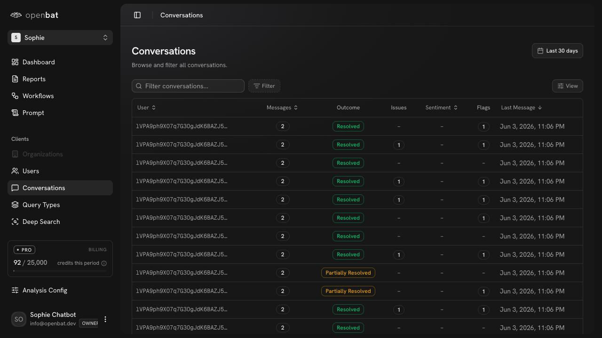
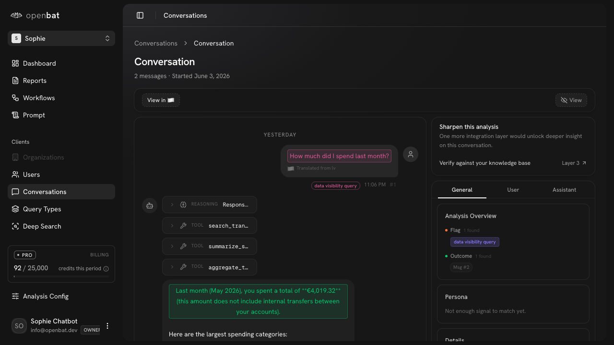

# Review a specific conversation

## Overview

| Property | Value |
|----------|-------|
| **Flow** | Review a specific conversation |
| **Starting Page** | `/platform/[chatbotId]/conversations` |
| **Persona** | CS manager investigating a flagged interaction to understand why a customer expressed frustration |

## Description

View a specific conversation's full message thread and analysis results

## Preconditions

- Conversations exist in the chatbot

## Steps

### Step 1

Navigate to /platform/[chatbotId]/conversations — table with User, Messages, Outcome, Issues, Sentiment, Flags, Last Message columns. Search/filter bar. Date filter: Last 30 days.

### Step 2

Click first conversation row — detail page loads with full message thread: user message 'How much did I spend last month?' (translated from Latvian), assistant response with REASONING, TOOL calls (search_tran, summarize_s, aggregate_t), and formatted answer '€4,019.32'. Right panel shows Analysis Overview (Flag: data visibility query, Outcome: Msg #2), Persona section, General/User/Assistant tabs.

## Expected Outcome

User understands the full context of the conversation including analysis tags, flags, and outcomes

## Related Flows

- [Configure analysis definitions](configure-analysis-definitions.md)

## Alternative Paths

- Use search/filter to narrow results
