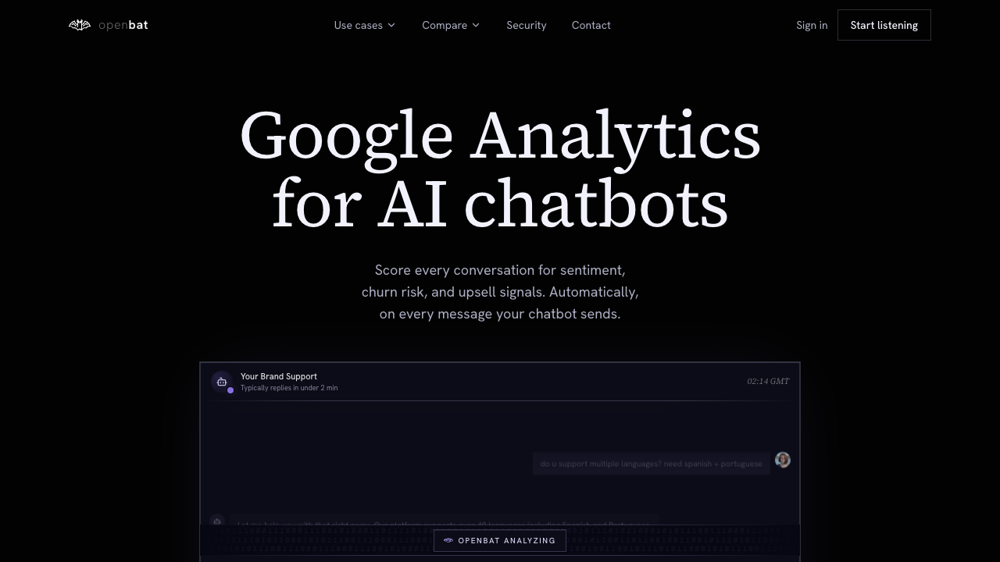
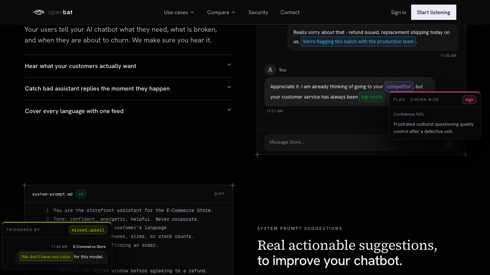
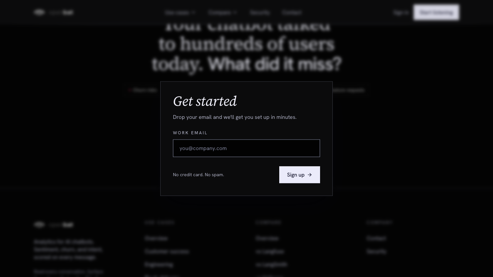
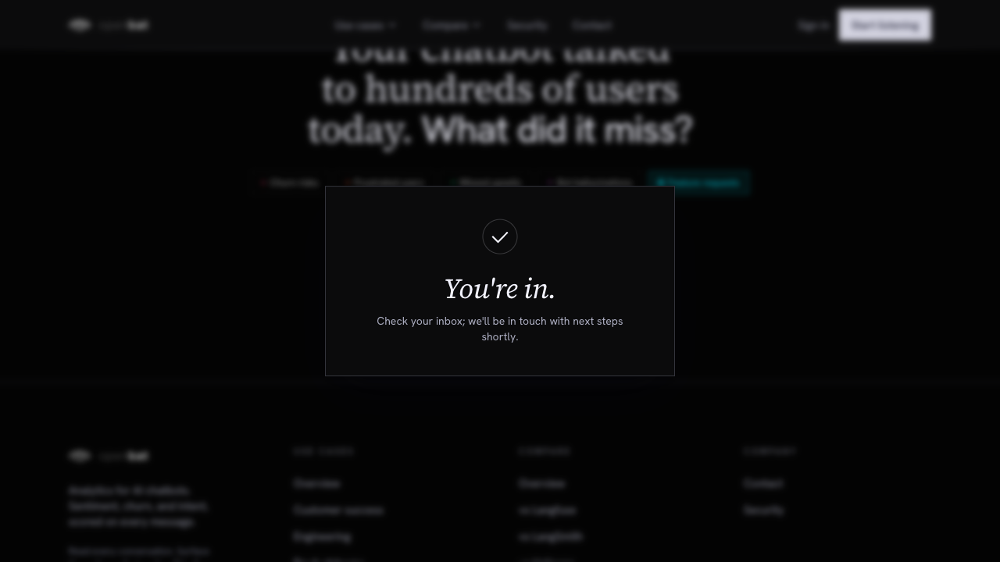

# Sign up from landing page

## Overview

| Property | Value |
|----------|-------|
| **Flow** | Sign up from landing page |
| **Starting Page** | `/` |
| **Persona** | Product manager at a company running an AI chatbot who wants visibility into conversation quality and customer sentiment |

## Description

Visitor lands on homepage, scrolls features, clicks 'Start listening' CTA

## Preconditions

- Visitor does not have an existing OpenBat account

## Steps

### Step 1

Land on the homepage at openbat.dev — hero section visible with 'Google Analytics for AI chatbots' heading

### Step 2

Scroll through feature sections (problem statement, ingest & analyze, system prompt suggestions, stakeholder notifications, analytics, integration code)

### Step 3

Click 'Start listening' button (appears in nav header, mid-page CTA, and bottom CTA) — opens inline 'Get started' modal with work email field, NOT a redirect to /auth/sign-up

### Step 4

Enter email in modal and click 'Sign up' — shows 'You're in. Check your inbox; we'll be in touch with next steps shortly.' confirmation

## Expected Outcome

User lands on the sign-up page and can create an account

## Failure Modes

### Already logged-in user clicks 'Start listening'

Same lead-capture modal opens — no redirect to /platform. Nav still shows 'Sign in' button even when authenticated.

## Related Flows

- [Email sign up](email-sign-up.md)
- [Email login](email-login.md)

## Alternative Paths

- Direct navigation to /auth/sign-up
