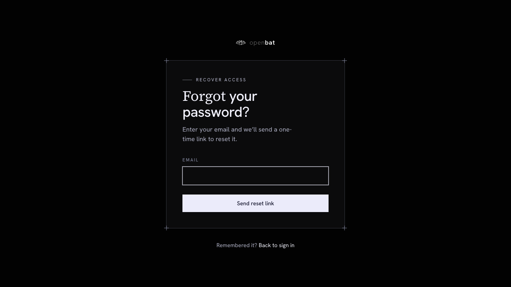

# Analysis Config

## Overview

| Property | Value |
|----------|-------|
| **URL** | `/platform/[chatbotId]/analysis-config` |
| **Application** | http://openbat.dev/auth/login |
| **Discovered** | 2026-06-04T08:23:49.143Z |

## Description

Comprehensive analysis configuration page with 7 tabs: Integration (5-layer integration maturity from baseline to DB-backed prompt with code recipes), Metadata (managed and discovered custom fields from SDK), Translation (auto-translate toggle with primary language selection), User Analysis (sentiment scoring, AI literacy, flags with custom definitions), Assistant Analysis (outcome types, issue types with custom definitions), Calibration (training examples for sentiment/intent/flags/outcomes/issues/faithfulness), Personas (AI-generated user persona cards with auto-discovery).

## Who Uses This

Engineering and product leads configuring how the chatbot's conversations are analyzed.

## Preconditions

- User is authenticated
- User has owner or admin role

## Page Context

Accessed from the bottom of the chatbot sidebar. The most configuration-heavy page in the app.



## Key Actions

- View integration maturity level and follow setup recipes
- Track or deny discovered metadata fields
- Toggle auto-translation and set primary language
- Configure sentiment scoring levels and priorities
- Configure outcome and issue definitions
- Manage calibration training examples
- Create and manage user personas
- Add custom flag and issue definitions

## Expected Outcome

Analysis pipeline is configured to match the chatbot's specific domain, language, and business needs.

## Interactive Elements

- tabs: Integration/Metadata/Translation/User Analysis/Assistant Analysis/Calibration/Personas
- integration layer cards with code recipes
- metadata table with Track buttons
- translation toggle and language picker
- analysis definition tables with toggles
- calibration example lists
- persona cards with AI generation

## Flows Starting Here

- [Configure analysis definitions](../flows/configure-analysis-definitions.md) — Customize what the AI analysis pipeline looks for — add custom flags, outcomes, or issues specific to your business domain.

## Navigation Path

```
http://openbat.dev/auth/login → /platform/[chatbotId]/analysis-config
```
