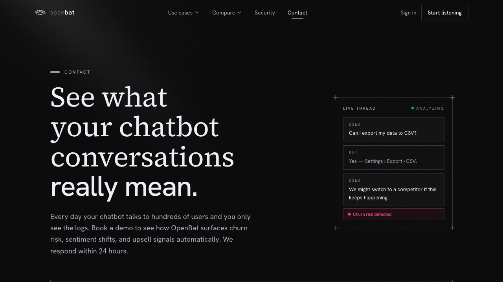

# Chatbot Onboarding

## Overview

| Property | Value |
|----------|-------|
| **URL** | `/platform/[chatbotId]/onboarding` |
| **Application** | http://openbat.dev/auth/login |
| **Discovered** | 2026-06-04T08:23:49.143Z |

## Description

SDK setup wizard for newly created chatbots. Guides users through copying the API key and integrating the OpenBat SDK. Redirects to the dashboard once onboarding is marked complete.

## Who Uses This

Developer who just created a new chatbot and needs to set up the SDK integration.

## Preconditions

- Chatbot exists but has not been onboarded yet (settings.onboarded !== true)

## Page Context

Automatically shown after creating a new chatbot. Redirects to dashboard if already onboarded.



## Key Actions

- Copy API key
- Follow SDK installation steps
- Complete onboarding to reach dashboard

## Expected Outcome

SDK is integrated and the chatbot starts receiving and analyzing conversations.

## Interactive Elements

- code snippets: SDK setup
- button: copy API key
- progress steps

## Navigation Path

```
http://openbat.dev/auth/login → /platform/[chatbotId]/onboarding
```
