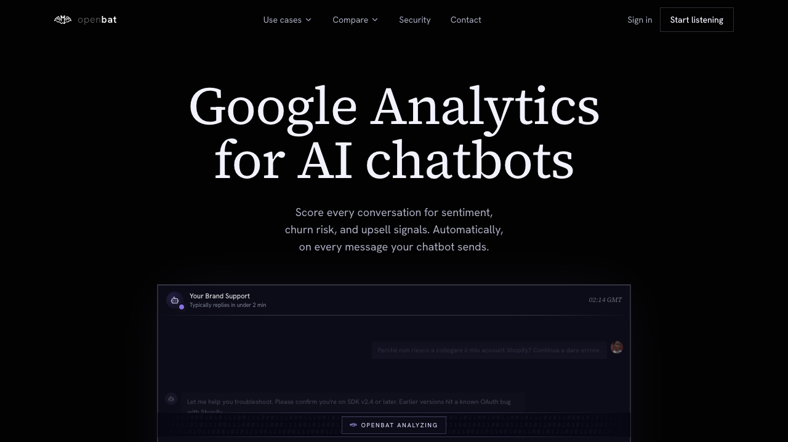

# Chatbot Settings

## Overview

| Property | Value |
|----------|-------|
| **URL** | `/platform/[chatbotId]/settings` |
| **Application** | http://openbat.dev/auth/login |
| **Discovered** | 2026-06-04T08:23:49.143Z |

## Description

Chatbot-level settings with 7 tabs: General (name, ID, creation date, analysis toggles, re-analyze, delete), Billing (Pro plan at $39/mo with credit usage and top-up), Company Info (product name, URL, description, industry for hallucination detection context), API Keys (ingest key management with prefix, status, last used), Members (chatbot-level access), Webhooks (Discord/Slack/custom webhook destinations), Import/Export Data (JSON/CSV export with analysis results, CSV/JSON import).

## Who Uses This

Team admin or owner managing chatbot configuration, API keys, billing, and integrations.

## Preconditions

- User is authenticated
- User has owner or admin role

## Page Context

Accessed from the bottom of the chatbot sidebar. Contains all chatbot-level configuration that doesn't relate to analysis definitions.



## Key Actions

- Edit chatbot display name
- Copy chatbot ID
- Toggle user/assistant message analysis
- Re-analyze all conversations
- View and manage billing plan
- Purchase credit top-ups
- Edit company/product information
- View and rotate API keys
- Configure webhook destinations
- Export conversation data as JSON/CSV
- Import conversation data from file
- Delete chatbot (danger zone)

## Expected Outcome

Chatbot is fully configured with API keys, billing, webhooks, and company context.

## Interactive Elements

- tabs: General/Billing/Company Info/API Keys/Members/Webhooks/Import-Export Data
- forms and buttons for each section

## Flows Starting Here

- [Export conversation data](../flows/export-conversation-data.md) — Download all conversation data including messages and analysis results for external processing or backup.

## Navigation Path

```
http://openbat.dev/auth/login → /platform/[chatbotId]/settings
```
