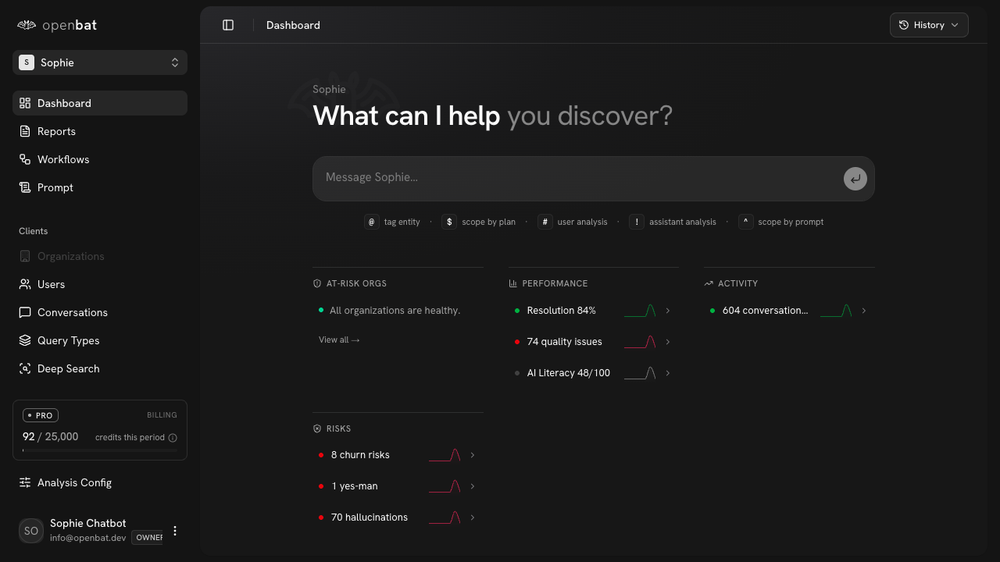

# Compare Overview

## Overview

| Property | Value |
|----------|-------|
| **URL** | `/compare` |
| **Application** | http://openbat.dev/auth/login |
| **Discovered** | 2026-06-04T08:23:49.143Z |

## Description

Marketing page positioning OpenBat against LLM observability tools. Highlights that competitors count tokens while OpenBat surfaces business intelligence (churn, sentiment, feature requests).

## Who Uses This

Prospective customers comparing OpenBat to alternatives like Langfuse, LangSmith, Helicone, and Braintrust.

## Preconditions

- None — public page

## Page Context

Accessed from the top navigation 'Compare' dropdown or footer links. Links to 6 specific comparison pages.



## Key Actions

- Read competitive positioning
- Navigate to specific comparison pages

## Expected Outcome

Visitor understands how OpenBat differs from the alternatives.

## Interactive Elements

- hero section
- comparison content

## Navigation Path

```
http://openbat.dev/auth/login → /compare
```
