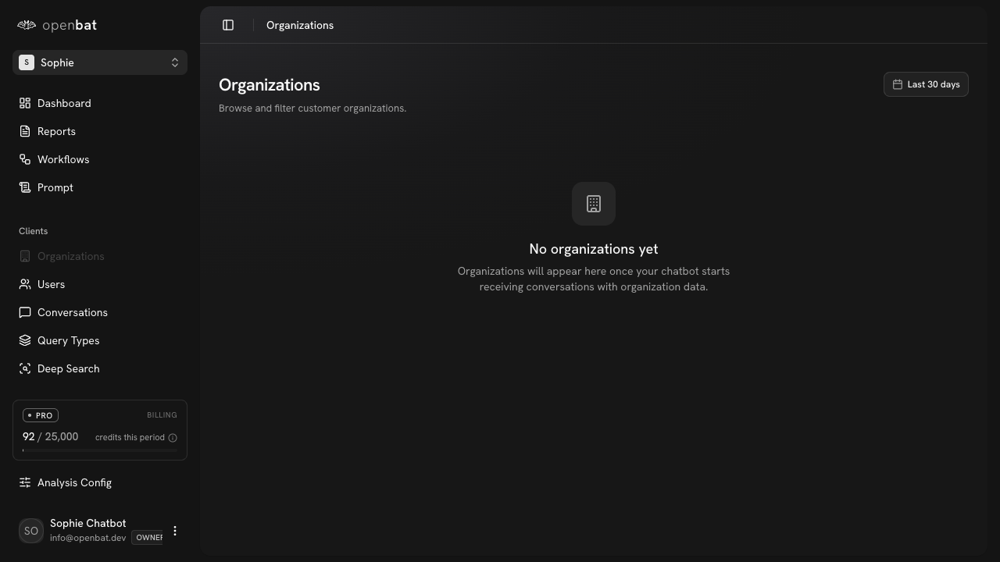

# Compare — vs Langfuse

## Overview

| Property | Value |
|----------|-------|
| **URL** | `/compare/langfuse` |
| **Application** | http://openbat.dev/auth/login |
| **Discovered** | 2026-06-04T08:23:49.143Z |

## Description

Head-to-head comparison page positioning OpenBat (business intelligence for product/CS teams) against Langfuse (LLM tracing for engineers).

## Who Uses This

Teams evaluating Langfuse who want to understand the difference.

## Preconditions

- None — public page

## Page Context

One of 6 competitor comparison pages. Same template as other /compare/* pages.



## Key Actions

- Read comparison points
- Click CTA to try OpenBat

## Expected Outcome

Visitor understands the key differences and decides which tool fits their needs.

## Interactive Elements

- comparison content
- CTA

## Navigation Path

```
http://openbat.dev/auth/login → /compare/langfuse
```
