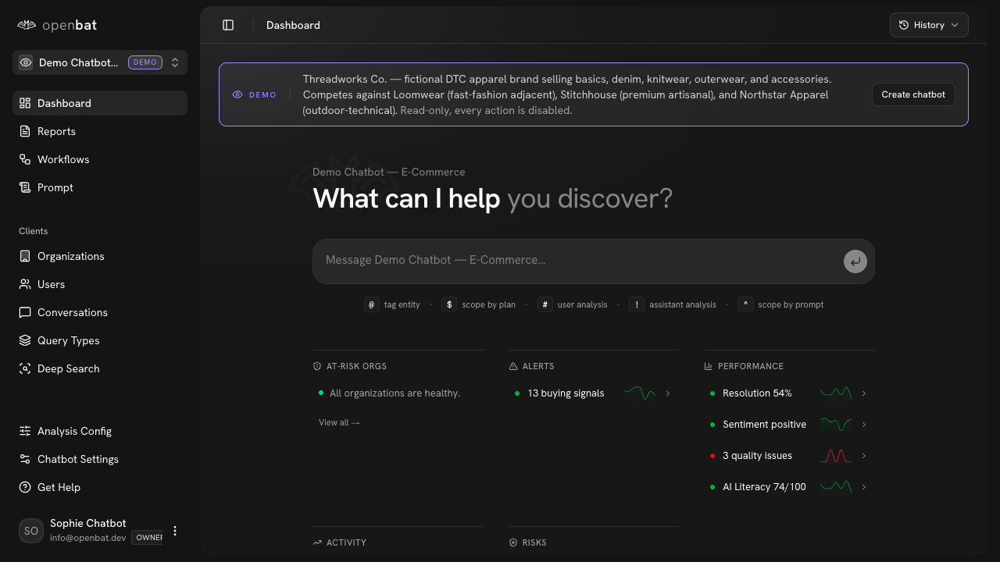

# Compare — vs LangSmith

## Overview

| Property | Value |
|----------|-------|
| **URL** | `/compare/langsmith` |
| **Application** | http://openbat.dev/auth/login |
| **Discovered** | 2026-06-04T08:23:49.143Z |

## Description

Comparison page: OpenBat vs LangSmith (tracing tool vs business intelligence).

## Who Uses This

Teams evaluating LangSmith.

## Preconditions

- None — public page

## Page Context

One of 6 competitor comparison pages.



## Key Actions

- Read comparison points

## Expected Outcome

Visitor understands the positioning difference.

## Interactive Elements

- comparison content

## Navigation Path

```
http://openbat.dev/auth/login → /compare/langsmith
```
