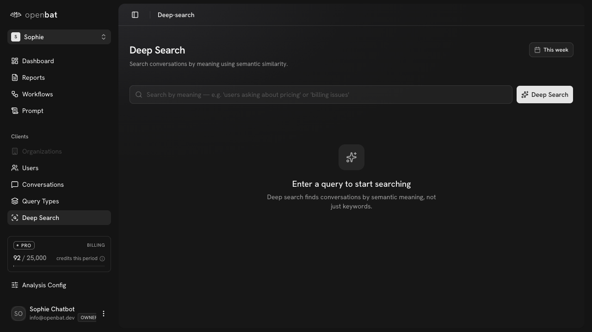

# Conversation Detail

## Overview

| Property | Value |
|----------|-------|
| **URL** | `/platform/[chatbotId]/conversations/[id]` |
| **Application** | http://openbat.dev/auth/login |
| **Discovered** | 2026-06-04T08:23:49.143Z |

## Description

Full conversation transcript view with chat bubbles for user (pink) and assistant (green) messages. Shows translation indicators, analysis tags (e.g., 'data visibility query'), expandable reasoning and tool call sections. Right panel has three tabs: General (Analysis Overview with flags, outcomes), User (user-specific analysis), Assistant (assistant-specific analysis). Also shows Persona matching and a 'Sharpen this analysis' CTA for deeper integration.

## Who Uses This

Any team member reviewing a specific conversation's content and analysis results.

## Preconditions

- User is authenticated
- Conversation exists

## Page Context

Accessed by clicking a row in the conversations list. Breadcrumb navigation back to Conversations list.



## Key Actions

- Read full conversation thread
- Expand reasoning and tool call details
- Switch between General/User/Assistant analysis tabs
- View flags and outcomes
- View persona match
- Click 'View in' to see original context

## Expected Outcome

User fully understands what happened in the conversation and what analysis was performed.

## Interactive Elements

- chat bubbles: user/assistant messages
- badges: analysis tags
- expandable: Reasoning/Tool sections
- tabs: General/User/Assistant
- cards: Flag count, Outcome, Persona
- button: View in (original context)
- button: View (layout toggle)
- breadcrumb: Conversations > Conversation

## Navigation Path

```
http://openbat.dev/auth/login → /platform/[chatbotId]/conversations/[id]
```
