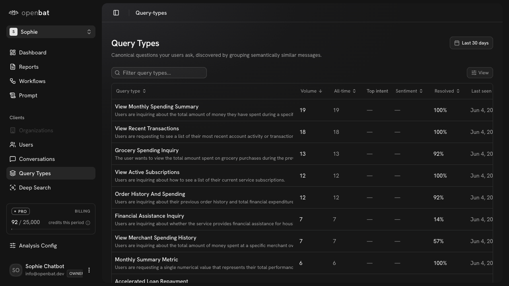

# Conversations

## Overview

| Property | Value |
|----------|-------|
| **URL** | `/platform/[chatbotId]/conversations` |
| **Application** | http://openbat.dev/auth/login |
| **Discovered** | 2026-06-04T08:23:49.143Z |

## Description

Conversation list page with a sortable, filterable data table. Columns: User, Messages count, Outcome (Resolved/Partially Resolved/Failed), Issues count, Sentiment, Flags count, Last Message timestamp. Supports text search, faceted filters, date range, column sorting, view customization, and pagination (604 rows, 31 pages).

## Who Uses This

Any team member who wants to browse, filter, and drill into individual chatbot conversations.

## Preconditions

- User is authenticated
- Chatbot has captured conversations

## Page Context

Accessed from the chatbot sidebar under 'Clients'. Primary way to find and review specific conversations.



## Key Actions

- Search conversations by keyword
- Apply faceted filters (outcome, sentiment, flags)
- Sort by any column
- Change date range
- Click a row to open conversation detail
- Customize visible columns
- Navigate between pages

## Expected Outcome

User finds relevant conversations and drills into them for detailed analysis.

## Interactive Elements

- textbox: Filter conversations search
- button: Filter
- button: View
- button: date range picker
- table: sortable columns with 7 fields
- pagination

## Flows Starting Here

- [Review a specific conversation](../flows/review-a-specific-conversation.md) — Find and open a conversation to read the full message thread, see analysis results, and understand what happened.

## Navigation Path

```
http://openbat.dev/auth/login → /platform/[chatbotId]/conversations
```
