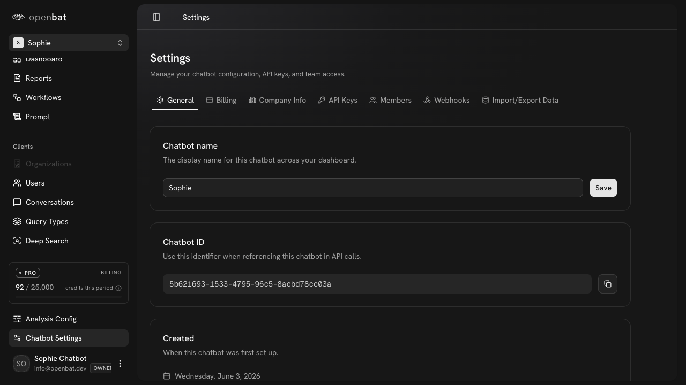

# Deep Search

## Overview

| Property | Value |
|----------|-------|
| **URL** | `/platform/[chatbotId]/deep-search` |
| **Application** | http://openbat.dev/auth/login |
| **Discovered** | 2026-06-04T08:23:49.143Z |

## Description

Semantic search interface that finds conversations by meaning rather than keywords. Single search input with a 'Deep Search' button and date range filter.

## Who Uses This

Any team member who needs to find specific conversations using natural-language queries rather than exact keyword matches.

## Preconditions

- User is authenticated
- Chatbot has conversation embeddings

## Page Context

Accessed from the chatbot sidebar under 'Clients'. Complements the keyword search in the conversations table.



## Key Actions

- Enter a semantic search query
- Click Deep Search
- Filter by date range
- Click search results to open conversation details

## Expected Outcome

User finds relevant conversations based on meaning/intent rather than exact keywords.

## Interactive Elements

- textbox: semantic search input
- button: Deep Search
- button: date range picker

## Navigation Path

```
http://openbat.dev/auth/login → /platform/[chatbotId]/deep-search
```
