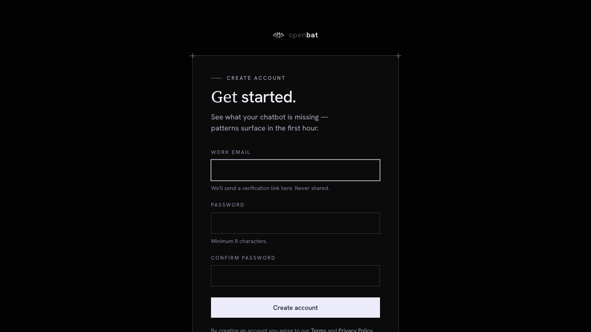

# External Customer Organizations

## Overview

| Property | Value |
|----------|-------|
| **URL** | `/platform/[chatbotId]/organizations` |
| **Application** | http://openbat.dev/auth/login |
| **Discovered** | 2026-06-04T08:23:49.143Z |

## Description

Directory of external customer organizations whose users interact with the chatbot. Populated automatically when the SDK sends organization metadata. Shows empty state when no organization data has been captured.

## Who Uses This

CS managers who want to monitor chatbot interaction health per customer organization.

## Preconditions

- User is authenticated
- Chatbot has conversations with organization metadata

## Page Context

Accessed from the chatbot sidebar under 'Clients'. Currently disabled in sidebar when no org data exists. Shows faceted filters and date range when populated.



## Key Actions

- Browse customer organizations
- Filter by date range
- Sort and filter organizations

## Expected Outcome

User sees per-organization health scores and can identify at-risk accounts.

## Interactive Elements

- button: date range picker
- empty state: No organizations yet

## Navigation Path

```
http://openbat.dev/auth/login → /platform/[chatbotId]/organizations
```
