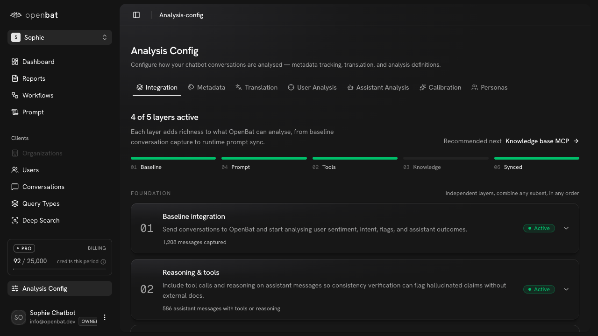

# Query Types

## Overview

| Property | Value |
|----------|-------|
| **URL** | `/platform/[chatbotId]/query-types` |
| **Application** | http://openbat.dev/auth/login |
| **Discovered** | 2026-06-04T08:23:49.143Z |

## Description

Semantic query type clustering page that automatically groups user messages into canonical question categories. Table columns: Query type (name + description), Volume (period), All-time count, Top intent, Sentiment, Resolved %, Last seen. Supports search, date range, view customization, and sorting.

## Who Uses This

Product team members who want to understand what users are asking the chatbot most frequently.

## Preconditions

- User is authenticated
- Chatbot has analyzed conversations

## Page Context

Accessed from the chatbot sidebar under 'Clients'. Shows AI-clustered question patterns rather than raw messages.



## Key Actions

- Browse query types sorted by volume
- Search for specific query types
- Filter by date range
- Sort by any column
- Click a query type to drill into its conversations

## Expected Outcome

User understands the most common question patterns and their resolution rates.

## Interactive Elements

- textbox: Filter query types search
- button: View
- button: date range picker
- table: sortable columns

## Navigation Path

```
http://openbat.dev/auth/login → /platform/[chatbotId]/query-types
```
