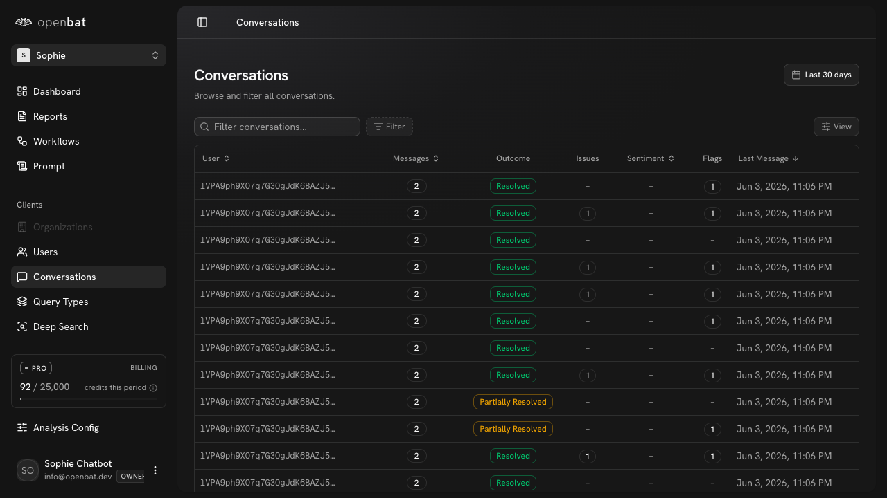

# System Prompt

## Overview

| Property | Value |
|----------|-------|
| **URL** | `/platform/[chatbotId]/system-prompt` |
| **Application** | http://openbat.dev/auth/login |
| **Discovered** | 2026-06-04T08:23:49.143Z |

## Description

Comprehensive system prompt management page with three tabs: Prompt (versioned prompt editor with timeline, publish mode toggle, kill switch, rollback, diff view), Experiments (A/B testing prompt changes against analysis tags), and Suggested (AI-suggested prompt improvements, coming soon). Shows prompt maturity level progression: Manual → Half-automated → Fully automated.

## Who Uses This

Engineering and product team members managing the chatbot's system prompt and running prompt experiments.

## Preconditions

- User is authenticated
- Chatbot belongs to user's organization

## Page Context

Accessed from the chatbot sidebar. Central place for prompt versioning, experiments, and AI-suggested improvements. The prompt can be in different maturity layers (manual, half-automated, fully automated).



## Key Actions

- View current live prompt version
- Create a new version (manual or AI)
- Toggle publish mode (Live/Draft)
- Toggle kill switch (emergency disable)
- Roll back to a previous version
- Switch between Full and Diff view
- Create a new experiment
- View prompt version timeline

## Expected Outcome

User manages prompt versions, runs experiments, and improves chatbot behavior based on analysis data.

## Interactive Elements

- tabs: Prompt/Experiments/Suggested
- timeline: version history (v1-v6)
- radio: Live/Draft publish mode
- switch: Kill switch
- button: Roll back
- radio: Full/Diff view
- button: New version
- button: Edit prompt
- button: New experiment

## Flows Starting Here

- [Create new prompt version](../flows/create-new-prompt-version.md) — Write or AI-generate a new system prompt version, preview it, and publish it live to affect future chatbot conversations.

## Navigation Path

```
http://openbat.dev/auth/login → /platform/[chatbotId]/system-prompt
```
