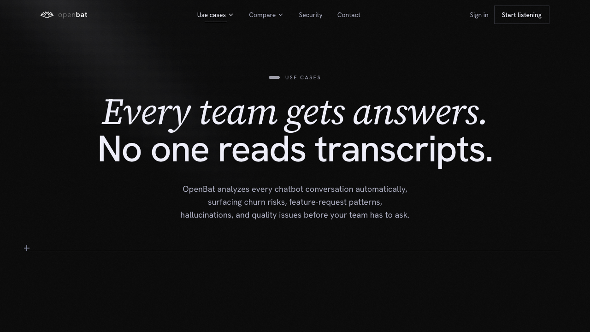

# Use Case — Customer Success

## Overview

| Property | Value |
|----------|-------|
| **URL** | `/use-cases/customer-success` |
| **Application** | http://openbat.dev/auth/login |
| **Discovered** | 2026-06-04T08:23:49.143Z |

## Description

Marketing page focused on how CS teams use OpenBat to detect churn risk, surface at-risk accounts, and monitor sentiment before renewal reviews.

## Who Uses This

Customer success managers evaluating chatbot analytics tools.

## Preconditions

- None — public page

## Page Context

Accessed from Use Cases overview or nav dropdown. One of 4 team-specific use case pages.



## Key Actions

- Read CS-specific value propositions
- Click CTA to start listening

## Expected Outcome

CS manager understands the specific value OpenBat provides for churn risk and account health monitoring.

## Interactive Elements

- hero section
- feature descriptions
- CTA buttons

## Navigation Path

```
http://openbat.dev/auth/login → /use-cases/customer-success
```
