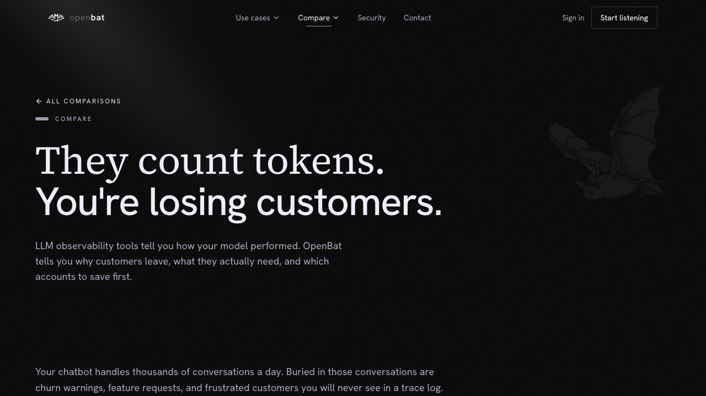

# Use Case — Product Teams

## Overview

| Property | Value |
|----------|-------|
| **URL** | `/use-cases/product-teams` |
| **Application** | http://openbat.dev/auth/login |
| **Discovered** | 2026-06-04T08:23:49.143Z |

## Description

Marketing page focused on how product teams use OpenBat to understand what users ask for, ranked by demand and sentiment.

## Who Uses This

Product managers evaluating tools for understanding chatbot user needs.

## Preconditions

- None — public page

## Page Context

One of 4 team-specific use case pages.



## Key Actions

- Read product-specific value propositions

## Expected Outcome

PM understands how OpenBat surfaces feature requests and user intent patterns.

## Interactive Elements

- hero section
- feature descriptions

## Navigation Path

```
http://openbat.dev/auth/login → /use-cases/product-teams
```
