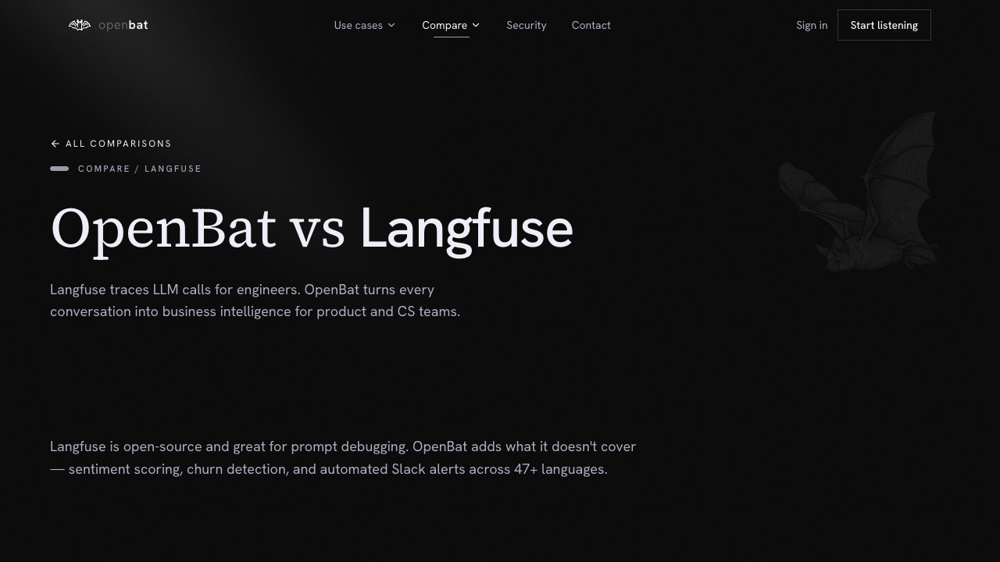

# Use Case — Support

## Overview

| Property | Value |
|----------|-------|
| **URL** | `/use-cases/support` |
| **Application** | http://openbat.dev/auth/login |
| **Discovered** | 2026-06-04T08:23:49.143Z |

## Description

Marketing page focused on how support teams use OpenBat to triage frustration and resolve issues faster.

## Who Uses This

Support team leads evaluating chatbot triage tools.

## Preconditions

- None — public page

## Page Context

One of 4 team-specific use case pages.



## Key Actions

- Read support-specific value propositions

## Expected Outcome

Support lead understands how OpenBat helps prioritize frustrated users.

## Interactive Elements

- hero section
- feature descriptions

## Navigation Path

```
http://openbat.dev/auth/login → /use-cases/support
```
