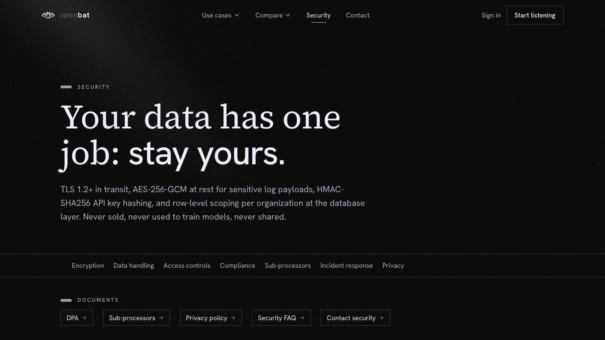

# Use Cases Overview

## Overview

| Property | Value |
|----------|-------|
| **URL** | `/use-cases` |
| **Application** | http://openbat.dev/auth/login |
| **Discovered** | 2026-06-04T08:23:49.143Z |

## Description

Marketing page showcasing how different teams use OpenBat. Links to dedicated pages for Customer Success, Engineering, Product Teams, and Support use cases.

## Who Uses This

Prospective customers evaluating OpenBat for their specific team's needs.

## Preconditions

- None — public page

## Page Context

Accessed from the top navigation 'Use cases' dropdown or footer links.



## Key Actions

- Browse use case summaries
- Navigate to specific use case pages

## Expected Outcome

Visitor understands how OpenBat applies to their team's specific needs.

## Interactive Elements

- hero section
- use case cards/links

## Navigation Path

```
http://openbat.dev/auth/login → /use-cases
```
