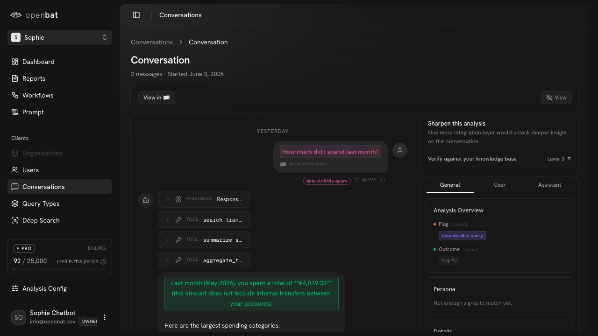

# Users

## Overview

| Property | Value |
|----------|-------|
| **URL** | `/platform/[chatbotId]/users` |
| **Application** | http://openbat.dev/auth/login |
| **Discovered** | 2026-06-04T08:23:49.143Z |

## Description

External chatbot user directory with a sortable, filterable data table. Columns: User (ID), Organization, Health score, Persona, AI Literacy score, Conversations count, Last Activity. Supports text search, faceted filters, date range picker, view customization, and pagination.

## Who Uses This

CS and product team members who want to understand individual chatbot user behavior and health.

## Preconditions

- User is authenticated
- Chatbot has captured conversations with user identifiers

## Page Context

Accessed from the chatbot sidebar under 'Clients'. Shows the end-users who interact with the chatbot (not team members).



## Key Actions

- Search users by name/ID
- Apply faceted filters
- Sort by any column
- Change date range
- Customize visible columns
- Click a user row to see their conversations

## Expected Outcome

User finds specific chatbot users and understands their engagement patterns and health scores.

## Interactive Elements

- textbox: Filter users search
- button: Filter
- button: View
- button: date range picker
- table: sortable columns
- pagination: rows per page selector

## Navigation Path

```
http://openbat.dev/auth/login → /platform/[chatbotId]/users
```
