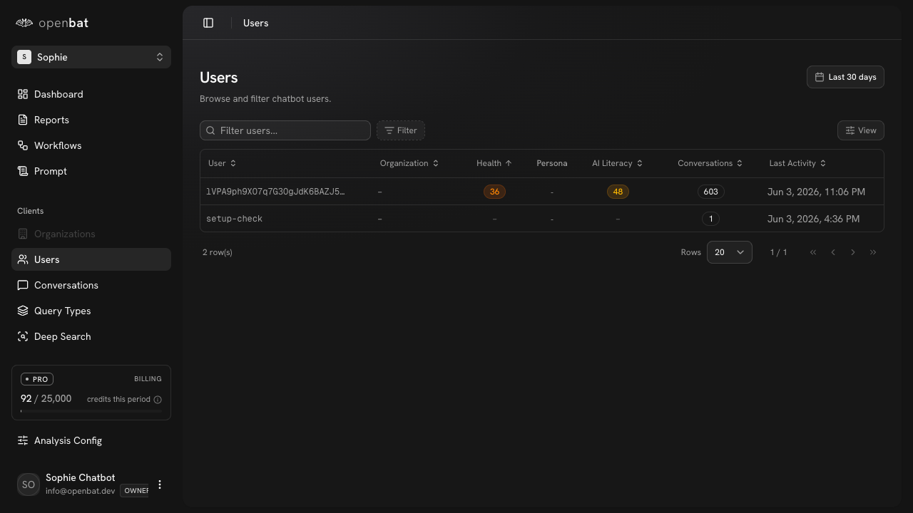

# Workflows

## Overview

| Property | Value |
|----------|-------|
| **URL** | `/platform/[chatbotId]/workflows` |
| **Application** | http://openbat.dev/auth/login |
| **Discovered** | 2026-06-04T08:23:49.143Z |

## Description

Automation hub for creating alert workflows triggered by analysis conditions. Three tabs: Workflows (list), Runs (execution history with status filters: All/Pending/Triggered/Skipped/Success/Failed), and Templates (pre-built workflow templates categorized by Alerting/Escalation/Reporting/Moderation/General).

## Who Uses This

Team members who want to automate alerts and actions based on conversation analysis patterns.

## Preconditions

- User is authenticated
- Chatbot belongs to user's organization

## Page Context

Accessed from the chatbot sidebar. Workflows connect analysis results to external actions (Slack, Discord, webhooks).



## Key Actions

- Create a new workflow
- Browse workflow templates
- Filter workflow runs by status
- View workflow execution history
- Switch between Workflows/Runs/Templates tabs

## Expected Outcome

User sets up automated workflows that fire when specific analysis conditions are met.

## Interactive Elements

- button: Create workflow
- tabs: Workflows/Runs/Templates
- filters: All/Pending/Triggered/Skipped/Success/Failed
- template cards with categories

## Flows Starting Here

- [Create workflow from template](../flows/create-workflow-from-template.md) — Set up an automated alert workflow using a pre-built template, such as notifying Slack when an organization becomes at-risk.

## Navigation Path

```
http://openbat.dev/auth/login → /platform/[chatbotId]/workflows
```
